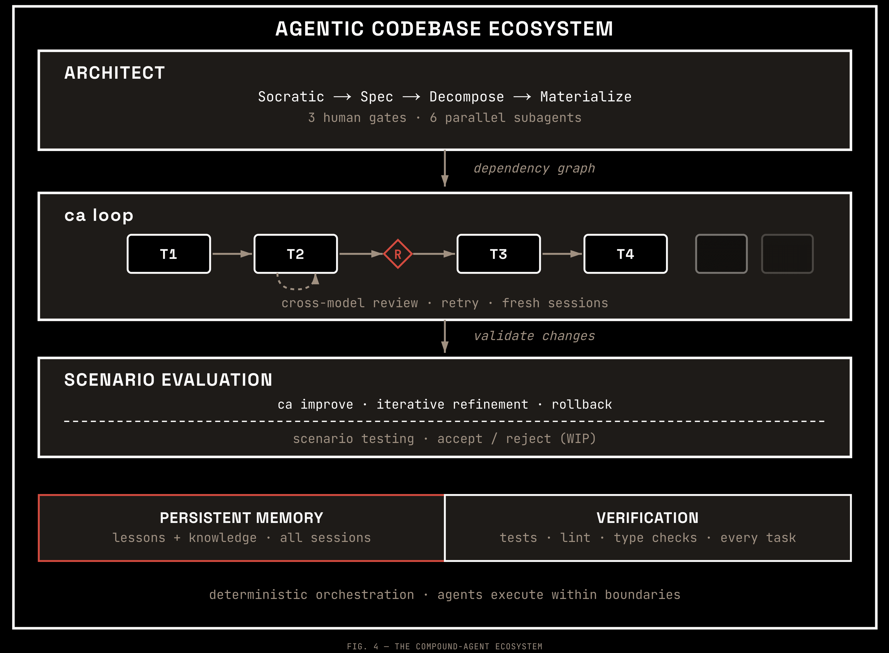
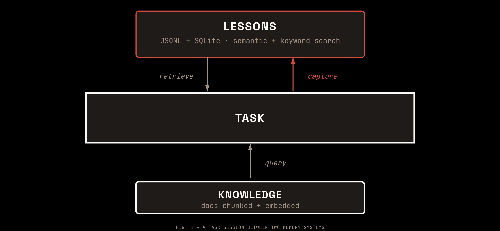
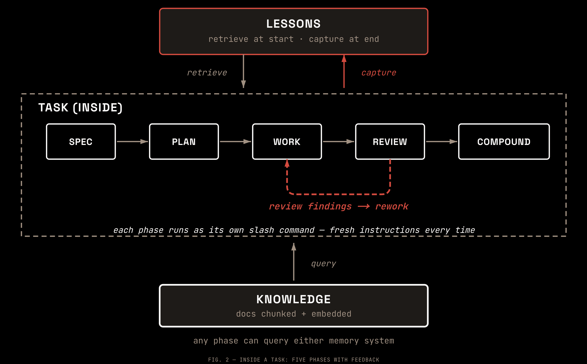
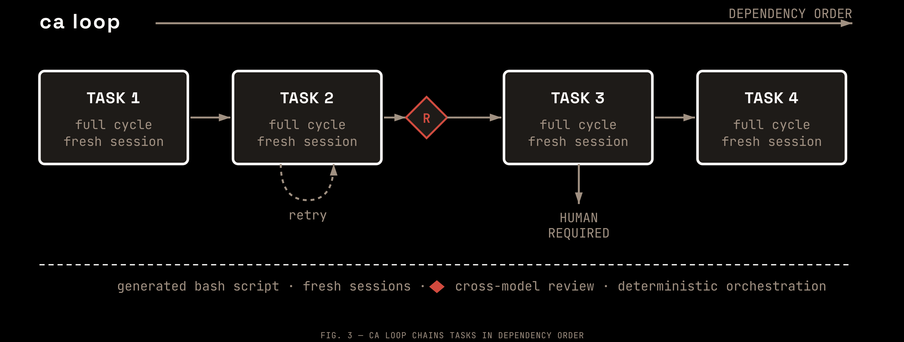
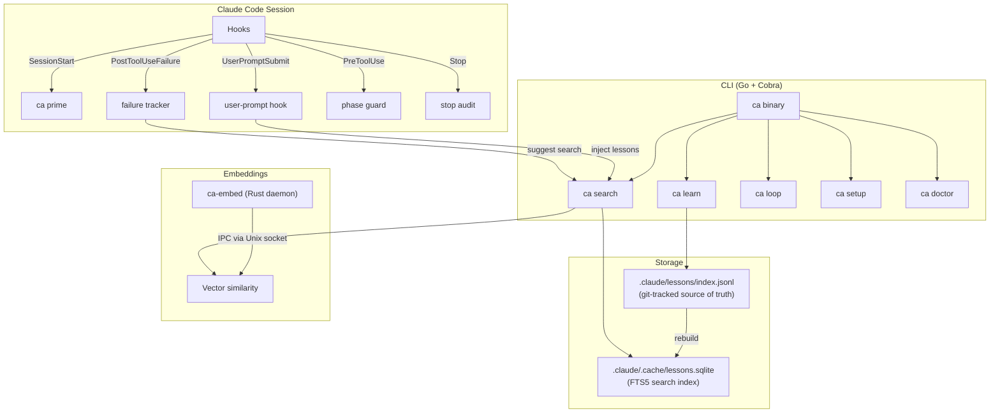

# Compound Agent

> compound-agent is a Claude Code plugin that ships a self-improving development factory into your repository — persistent memory, structured multi-agent workflows, and autonomous loop execution. Fully local. Everything in git.

[](https://www.npmjs.com/package/compound-agent)
[](LICENSE)
[](https://go.dev/)

<p align="center">
  
</p>

AI coding agents forget everything between sessions. Each session starts with whatever context was prepared for it — nothing more. Because agents carry no persistent state, that state must live in the codebase itself, and any agent that reads the same well-structured context should be able to pick up where another left off. Compound Agent implements this: it captures mistakes once, retrieves them precisely when relevant, and can hand entire systems to an autonomous loop that processes epic by epic with no human intervention.

## What gets installed

`ca setup` injects a complete development environment into your repository:

| Component | What ships |
|-----------|-----------|
| 16 slash commands | `/compound:architect`, `cook-it`, `spec-dev`, `plan`, `work`, `review`, `compound`, `learn-that`, `check-that`, and more |
| 26 agent role skills | Security reviewers, TDD pair, decomposition convoy, spec writers, test analysers, drift detectors, and more |
| 7 automatic hooks | Fire on session start, prompt submit, tool use, tool failure, pre-compact, phase guard, and session stop |
| 5 phase skill files | Full workflow instructions for `architect`, `spec-dev`, `cook-it`, `work`, and `review` |
| 5 deployed docs | Workflow reference, CLI reference, skills guide, integration guide, and overview |

This is not a memory plugin bolted onto a text editor. It is the environment your agents run inside.

## How it works

Two memory systems persist across sessions:

<p align="center">
  
</p>

- **Lessons** — mistakes, corrections, and patterns stored as git-tracked JSONL, indexed in SQLite FTS5 with local embeddings for hybrid search. Retrieved at the start of each task, captured at the end.
- **Knowledge** — project documentation chunked and embedded for semantic retrieval. Any phase can query it on demand.

Each task runs through five phases, with review findings looping back to rework. Each phase runs as its own slash command so instructions are re-injected fresh (surviving context compaction):

<p align="center">
  
</p>

Each cycle through the loop makes the next one smarter. The architect step is optional — use it for systems too large for a single feature cycle.

## Three principles

These constraints follow from how AI agents work, and each one maps to a layer of the architecture.

| Principle | Without it | Layer |
|-----------|-----------|-------|
| **Memory** | Same mistakes every session. Architectural decisions re-derived from scratch. Knowledge locked in human heads where agents cannot reach it. | Semantic Memory |
| **Feedback loops** | Agents cannot verify their own work. Manual review is the only quality gate. Drift is the default at agent-scale output. | Structured Workflows |
| **Navigable structure** | Context windows fill with orientation work. Agents make unverifiable assumptions about dependencies and ordering. | Beads Foundation |

The three are not independent. Memory without feedback loops is unreliable. Feedback without navigable structure fires blindly. The system works as a whole or not at all.

## Is this for you?

**"It keeps making the same mistake every session."**
Capture it once. Compound Agent surfaces it automatically before the agent repeats it.

**"I explained our auth pattern three sessions ago. Now it's reimplementing from scratch."**
Architectural decisions persist as searchable lessons. Next session, they inject into context before planning starts.

**"My agent uses pandas when we standardised on Polars months ago."**
Preferences survive across sessions and projects. Once captured, they appear at the right moment.

**"Code reviews keep catching the same class of bugs."**
24 specialised review agents (security, performance, architecture, test coverage) run in parallel. Findings feed back as lessons that become test requirements in future work.

**"I have no idea what my agent actually learned or if it's reliable."**
`ca list` shows all captured knowledge. `ca stats` shows health. `ca wrong <id>` invalidates bad lessons. Everything is git-tracked JSONL — you can read, diff, and audit it.

**"I want structured phases, not just 'go build this'."**
Five workflow phases (spec-dev, plan, work, review, compound) with mandatory gates between them. Each phase searches memory and docs for relevant context before starting.

**"My agent doesn't read the project docs before making decisions."**
`ca knowledge "auth flow"` runs hybrid search (vector + keyword) over your indexed docs. Agents query it automatically during planning — ADRs, specs, and standards surface before code gets written.

**"I want to hand a large system spec to the machine and walk away."**
`/compound:architect` decomposes it into epics. `ca loop` processes them autonomously.

## Levels of use

### Level 1 — Memory only

Two minutes to set up. Works in any session without changing your existing workflow.

```bash
# Capture a mistake or preference
ca learn "Always use Polars, not pandas in this project" --severity high
ca learn "Auth 401 fix: add X-Request-ID header" --type solution

# Search manually anytime
ca search "polars"

# Or let hooks surface it automatically — no command needed
```

### Level 2 — Structured workflow

One command runs all five phases on a single feature: spec-dev, plan, work (TDD + agent team), review (24 agents), and compound (capture lessons).

```bash
/compound:cook-it "Add rate limiting to the API"
```

Run phases individually when you want more control:

```bash
/compound:spec-dev "Add rate limiting"    # Socratic dialogue → EARS spec → Mermaid diagrams
/compound:plan                            # Tasks enriched by memory search
/compound:work                            # TDD with agent team
/compound:review                          # 24 parallel agents with severity gates
/compound:compound                        # Capture what was learned
```

### Level 3 — Factory mode

For systems too large for a single feature cycle. `/compound:architect` decomposes the system; `ca loop` processes the resulting epics autonomously.

```bash
# Step 1: decompose the system into epics
/compound:architect "Multi-tenant SaaS: auth, billing, API, admin dashboard"
# → Socratic dialogue → system-level EARS spec → DDD decomposition
# → N epics with dependency graph, interface contracts, and scope boundaries

# Step 2: generate and run the loop
ca loop --reviewers claude-sonnet --review-every 3
./infinity-loop.sh
# → Processes each epic in dependency order: spec-dev → plan → work → review → compound
# → Captures lessons after every cycle, improving subsequent cycles
```

## The infinity loop

<p align="center">
  
</p>

`ca loop` generates a bash script that processes your beads epics sequentially, running the full cook-it cycle on each one. No human intervention required between epics.

```bash
# Generate script for all ready epics
ca loop

# With periodic review every 3 epics
ca loop --reviewers claude-sonnet --review-every 3

# Target specific epics
ca loop --epics beads-abc beads-def beads-ghi --max-retries 2

# Run it
./infinity-loop.sh
```

The loop respects beads dependency graphs — it only processes epics whose dependencies are complete. If an epic fails after `--max-retries` attempts, it stops and reports before proceeding.

**Current maturity**: the loop works and has been used to ship real projects, including compound-agent itself. Two things still required human involvement: specifications had to be written before the loop started, and a human applied fixes after the first review pass surfaced real problems (missing error handling, a migration gap, insufficient test coverage). Fully unattended long-duration runs across many epics are the current area of hardening.

## The improvement loop

`ca improve` generates a bash script that iterates over `improve/*.md` program files, spawning Claude Code sessions to make focused improvements. Each program file defines what to improve, how to find work, and how to validate changes.

```bash
# Scaffold an example program file
ca improve init
# Creates improve/example.md with a linting template

# Generate the improvement script
ca improve

# Filter to specific topics
ca improve --topics lint tests --max-iters 3

# Preview without generating
ca improve --dry-run

# Run the generated script
./improvement-loop.sh

# Preview without executing Claude sessions
IMPROVE_DRY_RUN=1 ./improvement-loop.sh
```

Each iteration makes one focused improvement, commits it, and moves on. If an iteration finds nothing to improve or fails validation, it reverts cleanly and moves to the next topic. The loop tracks consecutive no-improvement results and stops early to avoid diminishing returns.

Monitor progress with `ca watch --improve` to see live trace output from improvement sessions.

## Automatic hooks

Once installed, seven Claude Code hooks fire without any commands:

| Hook | When it fires | What it does |
|------|--------------|--------------|
| `SessionStart` | Every new session | Loads high-severity lessons into context before you type anything |
| `PreCompact` | Before context compression | Saves phase state so cook-it survives compaction |
| `UserPromptSubmit` | Every prompt | Injects relevant memory items into context |
| `PreToolUse` | During cook-it | Enforces phase gates — prevents jumping ahead |
| `PostToolUse` | After tool success | Clears failure tracking state |
| `PostToolUseFailure` | After tool failure | Tracks failures; suggests memory search after repeated errors |
| `Stop` | Session end | Audits session for uncaptured lessons and unclosed issues |

No configuration needed. `ca setup` wires them into your `.claude/settings.json`.

## `/compound:architect`

AI agents work best on well-scoped problems. When a task exceeds what fits comfortably in one context window, quality degrades — not from lack of capability but from too many competing concerns pulling in different directions.

`/compound:architect` addresses this before the cook-it cycle begins. It takes a large system description and produces cook-it-ready epics via a structured 4-phase process:

1. **Socratic** — builds a domain glossary and discovery mindmap; classifies decisions by reversibility
2. **Spec** — produces system-level EARS requirements, C4 architecture diagrams, and a scenario table
3. **Decompose** — runs 6 parallel subagents (bounded context mapping, dependency analysis, scope sizing, interface design, STPA hazard analysis, structural-semantic gap analysis) then synthesises into a proposed epic structure
4. **Materialise** — creates beads epics with scope boundaries, interface contracts, and wired dependencies

Three human approval gates separate the phases. Each output epic is sized for one cook-it cycle and includes an EARS subset for traceability back to the system spec.

```bash
/compound:architect "Build a data pipeline: ingestion, transformation, storage, and API layer"
```

## Installation

```bash
# Install as dev dependency
pnpm add -D compound-agent

# One-shot setup (creates dirs, hooks, templates)
npx ca setup
```

### Requirements

- Node.js >= 20 (for `npx` wrapper — the CLI itself is a Go binary)
- ~278MB disk space for the embedding model (one-time download, shared across projects)
- Embedding runs via `ca-embed` Rust daemon (nomic-embed-text-v1.5 ONNX)

### Windows Users

Compound-agent requires WSL2 on Windows. Native Windows is not supported due to CGO and Unix socket dependencies.

```bash
# Install WSL2 (PowerShell as admin)
wsl --install

# Then install and run compound-agent inside WSL2
pnpm add -D compound-agent
npx ca setup
```

Run `ca doctor` inside WSL2 to verify your environment.

## CLI Reference

The CLI binary is `ca` (alias: `compound-agent`).

### Capture

| Command | Description |
|---------|-------------|
| `ca learn "<insight>"` | Capture a lesson manually |
| `ca learn "<insight>" --trigger "<context>"` | Capture with trigger context |
| `ca learn "<insight>" --severity high` | Set severity (low/medium/high) |
| `ca learn "<insight>" --citation src/api.ts:42` | Attach file provenance |
| `ca capture --input <file>` | Capture from structured input file |
| `ca detect --input <file>` | Detect correction patterns in input |

### Retrieval

| Command | Description |
|---------|-------------|
| `ca search "<query>"` | Keyword search across memory (FTS5) |
| `ca list` | List all memory items |
| `ca list --invalidated` | List only invalidated items |
| `ca check-plan --plan "<text>"` | Semantic search for plan-time retrieval |
| `ca load-session` | Load high-severity items for session start |

### Management

| Command | Description |
|---------|-------------|
| `ca show <id>` | Display item details |
| `ca update <id> --insight "..."` | Modify item fields |
| `ca delete <id>` | Soft-delete an item |
| `ca wrong <id>` | Mark item as invalid |
| `ca wrong <id> --reason "..."` | Mark invalid with reason |
| `ca validate <id>` | Re-enable an invalidated item |
| `ca stats` | Database health and age distribution |
| `ca rebuild` | Rebuild SQLite index from JSONL |
| `ca compact` | Archive old items, remove tombstones |
| `ca export` | Export items as JSON |
| `ca import <file>` | Import items from JSONL file |
| `ca prime` | Load workflow context (used by hooks) |
| `ca verify-gates <epic-id>` | Verify review + compound tasks exist and are closed |
| `ca phase-check` | Manage cook-it phase state (init/status/clean/gate) |
| `ca audit` | Run audit checks against the codebase |
| `ca rules check` | Run repository-defined rule checks |
| `ca test-summary` | Run tests and output a compact summary |

### Automation

| Command | Description |
|---------|-------------|
| `ca loop` | Generate infinity loop script for autonomous epic processing |
| `ca loop --epics <ids...>` | Target specific epic IDs |
| `ca loop -o <path>` | Custom output path (default: `./infinity-loop.sh`) |
| `ca loop --max-retries <n>` | Max retries per epic on failure (default: 1) |
| `ca loop --force` | Overwrite existing script |
| `ca loop --reviewers <names...>` | Enable review phase with specified reviewers (claude-sonnet, claude-opus, gemini, codex) |
| `ca loop --review-every <n>` | Review every N completed epics (0 = end-only, default: 0) |
| `ca loop --max-review-cycles <n>` | Max review/fix iterations (default: 3) |
| `ca loop --review-blocking` | Fail loop if review not approved after max cycles |
| `ca loop --review-model <model>` | Model for implementer fix sessions (default: claude-opus-4-6) |
| `ca improve` | Generate improvement loop script from `improve/*.md` programs |
| `ca improve --topics <names...>` | Run only specific topics |
| `ca improve --max-iters <n>` | Max iterations per topic (default: 5) |
| `ca improve --time-budget <seconds>` | Total time budget, 0=unlimited (default: 0) |
| `ca improve --dry-run` | Validate and print plan without generating |
| `ca improve --force` | Overwrite existing script |
| `ca improve init` | Scaffold an example `improve/*.md` program file |
| `ca watch` | Tail and pretty-print live trace from loop sessions |
| `ca watch --epic <id>` | Watch a specific epic trace |
| `ca watch --improve` | Watch improvement loop traces |
| `ca watch --no-follow` | Print existing trace and exit (no live tail) |

### Knowledge

| Command | Description |
|---------|-------------|
| `ca knowledge "<query>"` | Hybrid search over indexed project docs |
| `ca index-docs` | Index docs/ directory into knowledge base |

### Setup

| Command | Description |
|---------|-------------|
| `ca setup` | One-shot setup (hooks + templates) |
| `ca setup --skip-hooks` | Setup without installing hooks |
| `ca setup --json` | Output result as JSON |
| `ca setup claude` | Install Claude Code hooks only |
| `ca setup claude --status` | Check Claude Code integration health |
| `ca setup claude --uninstall` | Remove Claude hooks only |
| `ca setup claude --dry-run` | Preview what would change without writing |
| `ca init` | Initialize compound-agent in current repo |
| `ca init --skip-agents` | Skip AGENTS.md and template installation |
| `ca init --skip-claude` | Skip Claude Code hooks installation |
| `ca download-model --json` | Download embedding model with JSON output |
| `ca about` | Show version, animation, and recent changelog |
| `ca doctor` | Verify external dependencies and project health |

## Memory Types

| Type | Trigger means | Insight means | Example |
|------|---------------|---------------|---------|
| `lesson` | What happened | What was learned | "Polars 10x faster than pandas for large files" |
| `solution` | The problem | The resolution | "Auth 401 fix: add X-Request-ID header" |
| `pattern` | When it applies | Why it matters | `{ bad: "await in loop", good: "Promise.all" }` |
| `preference` | The context | The preference | "Use uv over pip in this project" |

### Retrieval Ranking

```
boost  = severity_boost * recency_boost * confirmation_boost
         clamped to max 1.8
score  = vector_similarity(query, item) * boost

severity_boost:     high=1.5, medium=1.0, low=0.8
recency_boost:      last 30d=1.2, older=1.0
confirmation_boost: confirmed=1.3, unconfirmed=1.0
```

## FAQ

**Q: How is this different from mem0?**
A: mem0 is a cloud memory layer for general AI agents. Compound Agent is local-first with git-tracked storage and local embeddings — no API keys or cloud services needed. It also goes beyond memory with structured workflows, multi-agent review, and issue tracking.

**Q: Does this work offline?**
A: Yes, completely. Embeddings run locally via the `ca-embed` Rust daemon (nomic-embed-text-v1.5 ONNX). No network requests after the initial model download.

**Q: How much disk space does it need?**
A: ~278MB for the embedding model (one-time download, shared across projects) plus negligible space for lessons.

**Q: Can I use it with other AI coding tools?**
A: The CLI (`ca`) works standalone with any tool. Full hook integration is available for Claude Code and Gemini CLI.

**Q: What happens if the embedding model isn't available?**
A: Search gracefully falls back to keyword-only mode. Other commands that require embeddings will tell you what's missing. Run `ca doctor` to diagnose issues.

**Q: Is the loop production-ready?**
A: The loop works and has been used to ship real projects, including compound-agent itself. Long-duration autonomous runs across many epics are the current area of hardening. For 3–5 epic sequences, it is reliable today.

## Development

```bash
cd go && go build -tags sqlite_fts5 ./cmd/ca   # Build CLI binary
cd go && go test -tags sqlite_fts5 ./...        # Full test suite
cd go && go vet -tags sqlite_fts5 ./...         # Static analysis
```

## Technology Stack

| Component | Technology |
|-----------|------------|
| Language | Go |
| Package Manager | Go modules (+ pnpm for npm wrapper) |
| Build | go build with CGO + sqlite_fts5 tag |
| Testing | go test + table-driven tests |
| Storage | mattn/go-sqlite3 + FTS5 |
| Embeddings | ca-embed (Rust daemon via IPC) |
| CLI | Cobra |
| Release | GoReleaser |
| Issue Tracking | Beads (bd) |

## Architecture



Three layers work together:
- **Portable storage**: JSONL in git for conflict-free collaboration
- **Fast index**: SQLite + FTS5 for keyword search, rebuilt from JSONL on demand
- **Semantic search**: Rust embedding daemon for vector similarity, falls back to keyword-only if unavailable

## Documentation

| Document | Purpose |
|----------|---------|
| [docs/ARCHITECTURE-V2.md](https://github.com/Nathandela/compound-agent/blob/main/docs/ARCHITECTURE-V2.md) | Three-layer architecture design |
| [docs/MIGRATION.md](https://github.com/Nathandela/compound-agent/blob/main/docs/MIGRATION.md) | Migration guide from learning-agent |
| [CHANGELOG.md](https://github.com/Nathandela/compound-agent/blob/main/CHANGELOG.md) | Version history |
| [AGENTS.md](https://github.com/Nathandela/compound-agent/blob/main/AGENTS.md) | Agent workflow instructions |

The most direct way to explore the system is to open this repository with an AI agent and ask it to walk you through the design — the project is structured precisely for that.

## Acknowledgments

Compound Agent builds on ideas and patterns from these projects:

| Project | Influence |
|---------|-----------|
| [Compound Engineering Plugin](https://github.com/EveryInc/compound-engineering-plugin) | The "compound" philosophy — each unit of work makes subsequent units easier. Multi-agent review workflows and skills as encoded knowledge. |
| [Beads](https://github.com/steveyegge/beads) | Git-backed JSONL + SQLite hybrid storage model, hash-based conflict-free IDs, dependency graphs |
| [OpenClaw](https://github.com/openclaw/openclaw) | Claude Code integration patterns and hook-based workflow architecture |

Also informed by research into [Reflexion](https://arxiv.org/abs/2303.11366) (verbal reinforcement learning), [Voyager](https://github.com/MineDojo/Voyager) (executable skill libraries), and production systems from mem0, Letta, and GitHub Copilot Memory.

## Contributing

Bug reports and feature requests are welcome via [Issues](https://github.com/Nathandela/compound-agent/issues). Pull requests are not accepted at this time — see [CONTRIBUTING.md](CONTRIBUTING.md) for details.

## License

MIT — see [LICENSE](LICENSE) for details.

> The embedding model (nomic-embed-text-v1.5) is downloaded on-demand from Hugging Face under the Apache 2.0 license. See [THIRD-PARTY-LICENSES.md](THIRD-PARTY-LICENSES.md) for full dependency license information.
