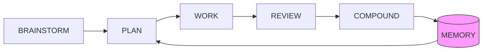
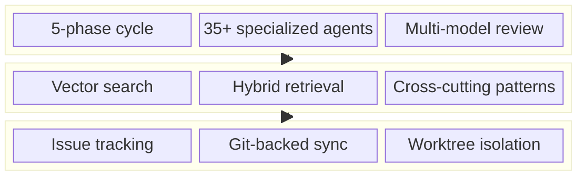

# Compound Agent

**Memory. Knowledge. Structure. Accountability. For AI coding agents.**

[](https://www.npmjs.com/package/compound-agent)
[](LICENSE)
[](https://www.typescriptlang.org/)

- **Memory** -- capture mistakes once, surface them forever
- **Knowledge** -- hybrid vector search over your project docs
- **Structure** -- 5-phase workflows with 35+ specialized agents
- **Accountability** -- git-tracked issues, multi-agent reviews, quality gates

Fully local. Fully offline. Everything in git.

## Overview

AI coding agents forget everything between sessions. Compound Agent fixes this with a three-layer system: issue tracking at the foundation, semantic memory with vector search in the middle, and structured workflows with multi-agent review on top. It captures knowledge from corrections, discoveries, and completed work, then retrieves it precisely when relevant. Every cycle through the loop makes subsequent cycles smarter.





## Is this for you?

**"It keeps making the same mistake every session."**
Capture it once. Compound Agent surfaces it automatically before the agent repeats it.

**"I explained our auth pattern three sessions ago. Now it's reimplementing from scratch."**
Architectural decisions persist as searchable lessons. Next session, they inject into context before planning starts.

**"My agent uses pandas when we standardized on Polars months ago."**
Preferences survive across sessions and projects. Once captured, they appear at the right moment.

**"Code reviews keep catching the same class of bugs."**
35+ specialized review agents (security, performance, architecture, test coverage) run in parallel. Findings feed back as lessons that become test requirements in future work.

**"I have no idea what my agent actually learned or if it's reliable."**
`ca list` shows all captured knowledge. `ca stats` shows health. `ca wrong <id>` invalidates bad lessons. Everything is git-tracked JSONL -- you can read, diff, and audit it.

**"I need to work on multiple features without them stepping on each other."**
`ca worktree create <epic>` gives each feature an isolated git worktree with its own branch, lessons, and merge-blocking quality gates.

**"I want structured phases, not just 'go build this'."**
Five workflow phases (brainstorm, plan, work, review, compound) with mandatory gates between them. Each phase searches memory and docs for relevant context before starting.

**"My agent doesn't read the project docs before making decisions."**
`ca knowledge "auth flow"` runs hybrid search (vector + keyword) over your indexed docs. Agents query it automatically during planning -- ADRs, specs, and standards surface before code gets written.

## Installation

```bash
# Install as dev dependency
pnpm add -D compound-agent

# One-shot setup (creates dirs, hooks, downloads model)
npx ca setup

# Skip the ~278MB model download (do it later)
npx ca setup --skip-model
```

### Requirements

- Node.js >= 20
- ~278MB disk space for the embedding model (one-time download, shared across projects)
- ~150MB RAM during embedding operations

### pnpm Users

pnpm v9+ blocks native addon builds by default. Running `npx ca setup` automatically detects pnpm and adds the required config to your `package.json`.

If you prefer to configure manually, add to your `package.json`:

```json
{
  "pnpm": {
    "onlyBuiltDependencies": ["better-sqlite3", "node-llama-cpp"]
  }
}
```

Then run `pnpm install`.

## Quick Start

The five-phase workflow:

```
1. /compound:brainstorm  -->  Explore the problem, clarify scope
2. /compound:plan        -->  Create tasks enriched by memory search
3. /compound:work        -->  Execute with agent teams + TDD
4. /compound:review      -->  Multi-agent review with inter-communication
5. /compound:compound    -->  Capture what was learned into memory
```

Or run all phases sequentially:

```
/compound:lfg "Add auth to API"
```

Each phase searches memory for relevant past knowledge and injects it into agent context. The compound phase captures new knowledge, closing the loop.

## CLI Reference

The CLI binary is `ca` (alias: `compound-agent`).

### Capture

| Command | Description |
|---------|-------------|
| `ca learn "<insight>"` | Capture a memory item manually |
| `ca learn "<insight>" --trigger "<context>"` | Capture with trigger context |
| `ca learn "<insight>" --severity high` | Set severity level |
| `ca learn "<insight>" --citation src/api.ts:42` | Attach file provenance |
| `ca capture --input <file>` | Capture from structured input file |
| `ca detect --input <file>` | Detect correction patterns in input |

### Retrieval

| Command | Description |
|---------|-------------|
| `ca search "<query>"` | Keyword search across memory (FTS5) |
| `ca list` | List all memory items |
| `ca list --invalidated` | List only invalidated items |
| `ca check-plan --plan "<text>"` | Semantic search for plan-time retrieval |
| `ca load-session` | Load high-severity items for session start |

### Management

| Command | Description |
|---------|-------------|
| `ca show <id>` | Display item details |
| `ca update <id> --insight "..."` | Modify item fields |
| `ca delete <id>` | Soft-delete an item |
| `ca wrong <id>` | Mark item as invalid |
| `ca wrong <id> --reason "..."` | Mark invalid with reason |
| `ca validate <id>` | Re-enable an invalidated item |
| `ca stats` | Database health and age distribution |
| `ca rebuild` | Rebuild SQLite index from JSONL |
| `ca compact` | Archive old items, remove tombstones |
| `ca export` | Export items as JSON |
| `ca import <file>` | Import items from JSONL file |
| `ca prime` | Load workflow context (used by hooks) |
| `ca verify-gates <epic-id>` | Verify review + compound tasks exist and are closed |
| `ca phase-check` | Manage LFG phase state (init/status/clean/gate) |
| `ca audit` | Run audit checks against the codebase |
| `ca rules check` | Run repository-defined rule checks |
| `ca test-summary` | Run tests and output a compact summary |

### Worktree

| Command | Description |
|---------|-------------|
| `ca worktree create <epic-id>` | Create isolated worktree for an epic |
| `ca worktree wire-deps <epic-id>` | Wire Review/Compound as merge blockers |
| `ca worktree merge <epic-id>` | Two-phase merge back to main |
| `ca worktree list` | List active worktrees with status |
| `ca worktree cleanup <epic-id>` | Remove worktree and clean up (--force for dirty) |

### Automation

| Command | Description |
|---------|-------------|
| `ca loop` | Generate infinity loop script for autonomous epic processing |
| `ca loop --epics <ids...>` | Target specific epic IDs |
| `ca loop -o <path>` | Custom output path (default: `./infinity-loop.sh`) |
| `ca loop --max-retries <n>` | Max retries per epic on failure (default: 1) |
| `ca loop --force` | Overwrite existing script |

### Knowledge

| Command | Description |
|---------|-------------|
| `ca knowledge "<query>"` | Hybrid search over indexed project docs |
| `ca index-docs` | Index docs/ directory into knowledge base |

### Setup

| Command | Description |
|---------|-------------|
| `ca setup` | One-shot setup (hooks + git pre-commit + model) |
| `ca setup --skip-model` | Setup without model download |
| `ca setup --uninstall` | Remove all generated files |
| `ca setup --update` | Regenerate files (preserves user customizations) |
| `ca setup --status` | Show installation status |
| `ca setup --dry-run` | Show what would change without changing |
| `ca setup claude --status` | Check Claude Code integration health |
| `ca setup claude --uninstall` | Remove Claude hooks only |
| `ca download-model` | Download the embedding model |
| `ca about` | Show version, animation, and recent changelog |
| `ca doctor` | Verify external dependencies and project health |

## Memory Types

| Type | Trigger means | Insight means | Example |
|------|---------------|---------------|---------|
| `lesson` | What happened | What was learned | "Polars 10x faster than pandas for large files" |
| `solution` | The problem | The resolution | "Auth 401 fix: add X-Request-ID header" |
| `pattern` | When it applies | Why it matters | `{ bad: "await in loop", good: "Promise.all" }` |
| `preference` | The context | The preference | "Use uv over pip in this project" |

### Retrieval Ranking

```
boost  = severity_boost * recency_boost * confirmation_boost
         clamped to max 1.8
score  = vector_similarity(query, item) * boost

severity_boost:     high=1.5, medium=1.0, low=0.8
recency_boost:      last 30d=1.2, older=1.0
confirmation_boost: confirmed=1.3, unconfirmed=1.0
```

## FAQ

**Q: How is this different from mem0?**
A: mem0 is a cloud memory layer for general AI agents. Compound Agent is local-first with git-tracked storage and local embeddings -- no API keys or cloud services needed. It also goes beyond memory with structured workflows, multi-agent review, and issue tracking.

**Q: Does this work offline?**
A: Yes, completely. Embeddings run locally via node-llama-cpp. No network requests after the initial model download.

**Q: How much disk space does it need?**
A: ~278MB for the embedding model (one-time download, shared across projects) plus negligible space for lessons.

**Q: Can I use it with other AI coding tools?**
A: The CLI (`ca`) works standalone with any tool. Full hook integration is available for Claude Code and Gemini CLI. The TypeScript API can be integrated into other tools.

**Q: What happens if the embedding model isn't available?**
A: Compound Agent hard-fails rather than silently degrading. Run `npx ca doctor` to diagnose issues.

## Development

```bash
pnpm install          # Install dependencies
pnpm build            # Build with tsup
pnpm dev              # Watch mode (rebuild on changes)
pnpm lint             # Type check + ESLint
```

| Script | Duration | Use Case |
|--------|----------|----------|
| `pnpm test:fast` | ~6s | Rapid feedback during development |
| `pnpm test` | ~60s | Full suite before committing |
| `pnpm test:changed` | varies | Only tests affected by recent changes |
| `pnpm test:watch` | - | Watch mode for TDD workflow |
| `pnpm test:all` | ~60s | Full suite with model download |

## Technology Stack

| Component | Technology |
|-----------|------------|
| Language | TypeScript (ESM) |
| Package Manager | pnpm |
| Build | tsup |
| Testing | Vitest + fast-check (property tests) |
| Storage | better-sqlite3 + FTS5 |
| Embeddings | node-llama-cpp + EmbeddingGemma-300M |
| CLI | Commander.js |
| Schema | Zod |
| Issue Tracking | Beads (bd) |

## Documentation

| Document | Purpose |
|----------|---------|
| [docs/ARCHITECTURE-V2.md](https://github.com/Nathandela/compound-agent/blob/main/docs/ARCHITECTURE-V2.md) | Three-layer architecture design |
| [docs/MIGRATION.md](https://github.com/Nathandela/compound-agent/blob/main/docs/MIGRATION.md) | Migration guide from learning-agent |
| [CHANGELOG.md](https://github.com/Nathandela/compound-agent/blob/main/CHANGELOG.md) | Version history |
| [AGENTS.md](https://github.com/Nathandela/compound-agent/blob/main/AGENTS.md) | Agent workflow instructions |

## Acknowledgments

Compound Agent builds on ideas and patterns from these projects:

| Project | Influence |
|---------|-----------|
| [Compound Engineering Plugin](https://github.com/EveryInc/compound-engineering-plugin) | The "compound" philosophy -- each unit of work makes subsequent units easier. Multi-agent review workflows and skills as encoded knowledge. |
| [Beads](https://github.com/steveyegge/beads) | Git-backed JSONL + SQLite hybrid storage model, hash-based conflict-free IDs, dependency graphs |
| [OpenClaw](https://github.com/openclaw/openclaw) | Claude Code integration patterns and hook-based workflow architecture |

Also informed by research into [Reflexion](https://arxiv.org/abs/2303.11366) (verbal reinforcement learning), [Voyager](https://github.com/MineDojo/Voyager) (executable skill libraries), and production systems from mem0, Letta, and GitHub Copilot Memory.

## Contributing

Bug reports and feature requests are welcome via [Issues](https://github.com/Nathandela/compound-agent/issues). Pull requests are not accepted at this time -- see [CONTRIBUTING.md](CONTRIBUTING.md) for details.

## License

MIT -- see [LICENSE](LICENSE) for details.

> The embedding model (EmbeddingGemma-300M) is downloaded on-demand and subject to Google's [Gemma Terms of Use](https://ai.google.dev/gemma/terms). See [THIRD-PARTY-LICENSES.md](THIRD-PARTY-LICENSES.md) for full dependency license information.
