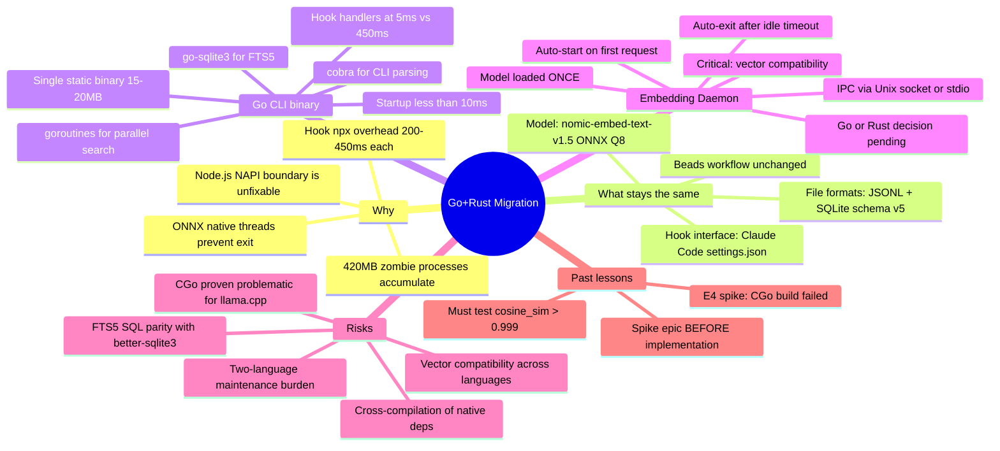
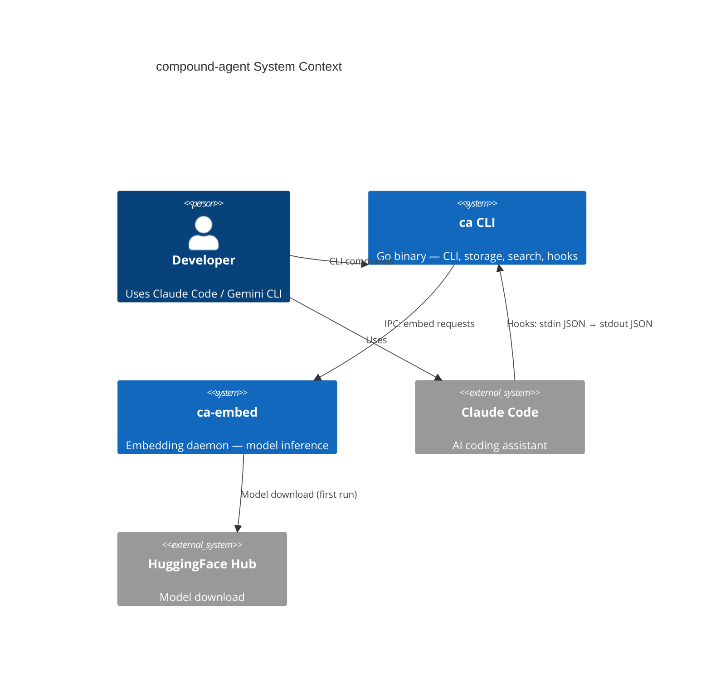
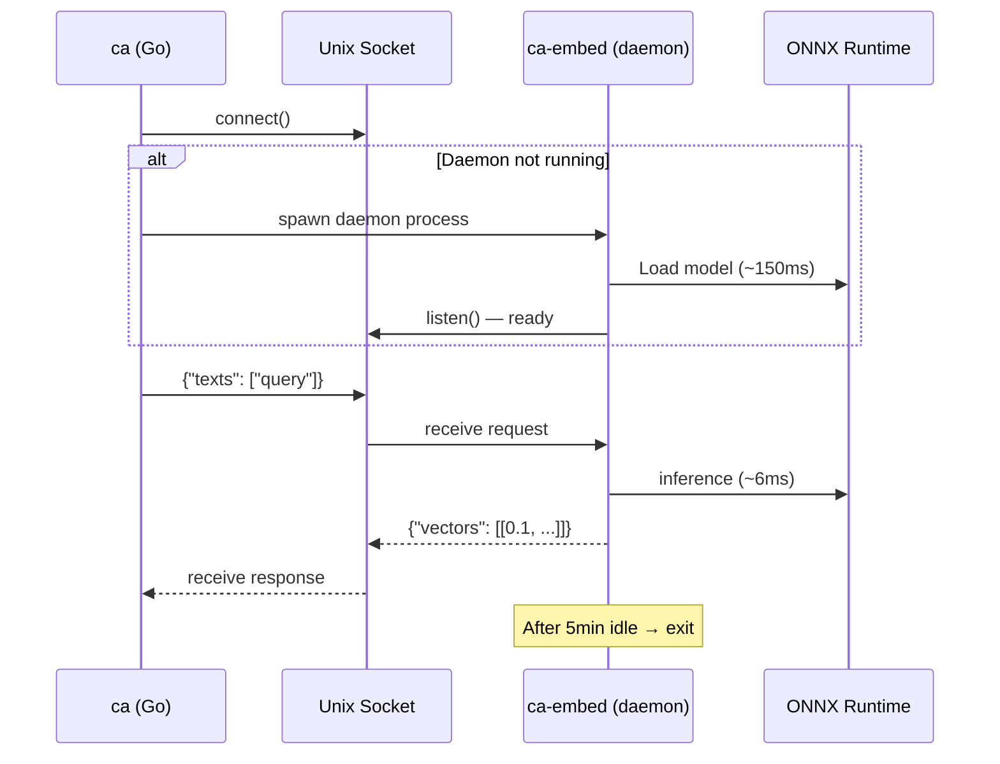
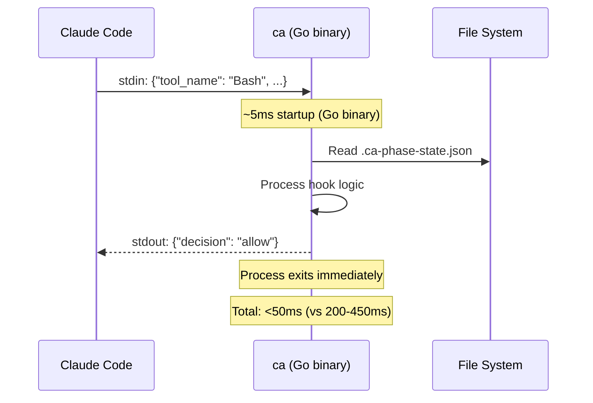
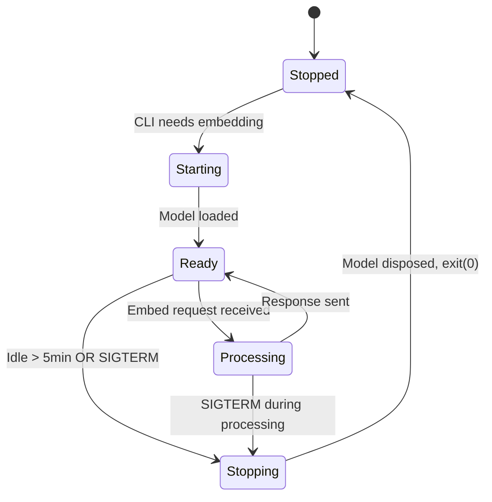
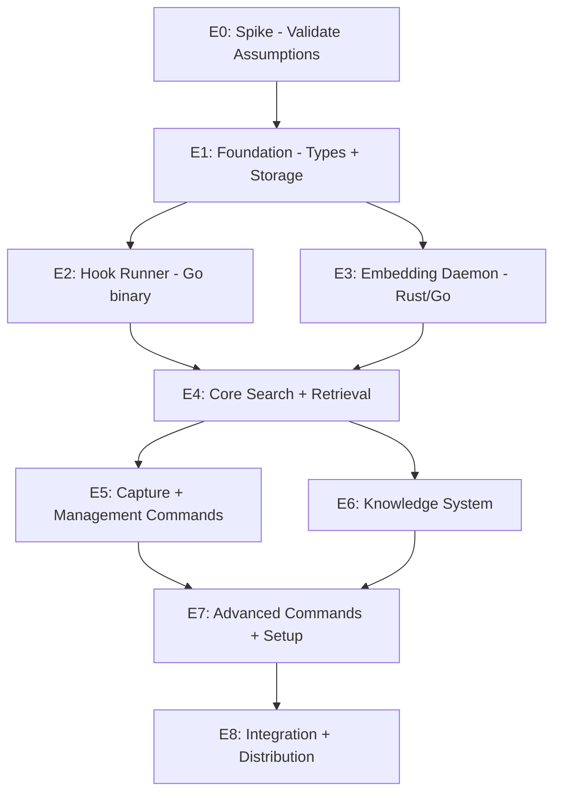

# Go + Rust Migration — System Spec

> **Date**: 2026-03-21
> **Status**: Phase 1 (Socratic) — In Progress
> **Author**: Architect skill
> **Input**: Investigation findings from process lifecycle analysis session

---

## 1. Problem Statement

The compound-agent TypeScript codebase has two structural defects unfixable within the Node.js/native addon architecture:

1. **ONNX Runtime zombie processes**: Native C++ threads prevent Node.js process exit after `dispose()`. Every CLI command that loads the embedding model (search, learn, knowledge, index-docs, embed-worker) creates a process that hangs forever. Each zombie: 420MB RSS, 14 threads. `process.exit()` causes SIGABRT (exit 134) due to corrupted C++ mutex. Only SIGKILL works.

2. **Hook process storm**: Claude Code hooks invoke `npx ca hooks run <hook>` on every tool call. Each invocation: ~126MB RSS, 200-450ms startup. 13+ concurrent hook processes observed during normal operation, consuming ~900MB total.

These problems are inherent to the Node.js + NAPI + ONNX Runtime architecture. Research in `docs/research/memory-leakage/` (6 papers) confirms subprocess isolation is the only guarantee for native addon cleanup.

## 2. Domain Glossary

| Term | Definition |
|------|-----------|
| **Lesson** | A captured insight with trigger, insight text, tags, severity, and metadata. Stored in JSONL. |
| **Memory Item** | Supertype of Lesson; includes type field (lesson, pattern, preference, solution). |
| **CCT Pattern** | Compound Correction Tracker pattern — aggregated mistake patterns from multiple lessons. |
| **Embedding** | 768-dimensional Float32Array vector from nomic-embed-text-v1.5 model (ONNX Q8 quantized). |
| **FTS5** | SQLite Full-Text Search extension used for keyword search. |
| **Vector Search** | Cosine similarity comparison between query embedding and cached lesson/chunk embeddings. |
| **Hybrid Search** | Weighted merge of FTS5 keyword results + vector similarity results. |
| **Knowledge Chunk** | A segment of a documentation file, stored with optional embedding for semantic search. |
| **Hook Handler** | A function invoked by Claude Code/Gemini on specific events (tool use, user prompt, etc.). |
| **Embedding Daemon** | (New) A persistent process that loads the model once and serves embedding requests via IPC. |
| **Beads** | The project's issue tracking system (`bd` CLI). |
| **Cook-it** | The infinity loop workflow: spec → plan → work → review → reflect. |

## 3. Discovery Mindmap



## 4. Reversibility Analysis

| Decision | Reversibility | Effort to reverse | Analysis time warranted |
|----------|--------------|-------------------|------------------------|
| Go for CLI | **Irreversible** (full rewrite) | Months | High — validate with prototype |
| Rust vs Go for embedding daemon | **Moderate** (~800 lines to rewrite) | 1-2 weeks | Medium — decide during spike |
| IPC protocol (UDS vs stdio) | **Reversible** (internal interface) | Days | Low — pick one, adjust later |
| File format compatibility | **Irreversible** (breaks existing installs) | N/A — must maintain | High — test thoroughly |
| ONNX model format | **Moderate** (re-embedding needed if changed) | Hours to days | Medium — validate in spike |
| CLI command surface (cobra) | **Low-moderate** (public API) | Weeks | Medium — match existing commands |

## 5. Change Volatility Assessment

| Boundary | Volatility | Justification |
|----------|-----------|---------------|
| Embedding API (text → vector) | **Stable** | Clean contract: string in, Float32Array out. 768 dims, normalized. Unchanged since E5 migration. |
| SQLite schema (v5) | **Stable** | Well-established, rarely changes. FTS5 queries are standard SQL. |
| JSONL format | **Stable** | Source of truth, append-only, Zod-validated schema. |
| CLI command surface | **Moderate** | New commands added periodically (~50 current). Must maintain backward compatibility. |
| Hook interface | **Stable** | JSON stdin/stdout protocol. 6 hook types. Changes rarely. |
| Search ranking algorithm | **Moderate** | Tweaked periodically (boosts, weights). Pure arithmetic, language-agnostic. |
| Knowledge indexing | **Moderate** | Chunking strategy evolves. File I/O + SQLite writes. |
| Setup/templates | **High** | Frequently updated as features change. Template strings, file generation. |

## 6. Key Assumptions

| # | Assumption | If wrong, impact |
|---|-----------|------------------|
| A1 | go-sqlite3 FTS5 produces identical results to better-sqlite3 for the same SQL queries | All search results differ — high impact |
| A2 | ONNX model can be loaded by a Go or Rust process and produce vectors with cosine_sim > 0.999 vs current TS output | All cached embeddings invalidated — high impact |
| A3 | Unix domain socket IPC adds < 5ms per embedding request | Search latency regresses — medium impact |
| A4 | Go binary can be distributed as a single file via npm package (like esbuild does) | Distribution model breaks — high impact |
| A5 | CGo-free Go is sufficient for CLI (no native deps except go-sqlite3) | Build complexity explodes — medium impact |
| A6 | Rust ort crate (or alternative) can load the same ONNX Q8 model files | Model conversion needed — medium impact |

---

## 7. System-Level EARS Requirements

### Ubiquitous (always true)

| ID | Requirement |
|----|-------------|
| U1 | The `ca` binary SHALL be a single static executable requiring no runtime dependencies beyond the OS. |
| U2 | The `ca` binary SHALL start in < 50ms on macOS ARM64 (measured from exec to first stdout byte). |
| U3 | All CLI commands SHALL produce output identical to the TypeScript version for the same inputs (behavioral parity). |
| U4 | The system SHALL read and write the same file formats: `.claude/lessons/index.jsonl` (JSONL), `.claude/.cache/lessons.sqlite` (SQLite v5 schema), `.claude/.cache/knowledge.sqlite`. |
| U5 | Hook handlers SHALL complete in < 50ms including process startup (vs current 200-450ms). |
| U6 | The embedding daemon SHALL be a separate process from the CLI binary. |
| U7 | Embedding vectors produced by the daemon SHALL have cosine similarity > 0.999 with vectors produced by the current TypeScript implementation for identical inputs. |

### Event-driven (when X happens)

| ID | Requirement |
|----|-------------|
| E1 | WHEN the CLI needs an embedding AND the daemon is not running, the CLI SHALL auto-start the daemon and wait for readiness (< 2s cold start). |
| E2 | WHEN the daemon has been idle for > 5 minutes, it SHALL exit cleanly, releasing all memory. |
| E3 | WHEN the daemon receives SIGTERM, it SHALL dispose the model and exit within 1 second. |
| E4 | WHEN a CLI command completes, the process SHALL exit within 100ms (no zombie processes). |
| E5 | WHEN `ca init` is run, the system SHALL generate Claude Code hook configurations pointing to the Go binary. |
| E6 | WHEN the embedding model is not available, search commands SHALL fall back to keyword-only (FTS5) search. |

### State-driven (while in state X)

| ID | Requirement |
|----|-------------|
| S1 | WHILE the daemon is running, it SHALL accept concurrent embedding requests via the IPC channel. |
| S2 | WHILE the daemon is running, its RSS SHALL remain < 200MB (model + runtime overhead). |
| S3 | WHILE processing a hook, the Go binary RSS SHALL remain < 15MB. |

### Unwanted behavior (shall NOT)

| ID | Requirement |
|----|-------------|
| N1 | The system SHALL NOT leave zombie processes after any CLI command exits. |
| N2 | The system SHALL NOT require `npx`, `node`, or any JavaScript runtime at runtime. |
| N3 | The system SHALL NOT break existing `.claude/` directory contents during migration. |
| N4 | The system SHALL NOT use CGo for the embedding daemon (proven problematic per lesson Lb2c65e5a). |
| N5 | The system SHALL NOT change the SQLite schema version (must remain v5-compatible). |

### Optional features

| ID | Requirement |
|----|-------------|
| O1 | The system MAY support Windows via stdio-based IPC instead of Unix domain sockets. |
| O2 | The system MAY provide a `ca doctor` command that validates both Go binary and daemon health. |
| O3 | The system MAY distribute via npm postinstall (download pre-built binary for platform, like esbuild). |

## 8. Architecture Diagrams

### 8.1 C4 Context



### 8.2 Embedding Request Sequence



### 8.3 Hook Handler Flow



### 8.4 Daemon Lifecycle State Diagram



## 9. Scenario Table

| ID | Source | Category | Precondition | Trigger | Expected Outcome |
|----|--------|----------|--------------|---------|------------------|
| SC1 | U1,N2 | happy | Go binary installed | `ca search "test"` | Returns results, exits in <100ms |
| SC2 | E1 | happy | Daemon not running, model available | `ca search "test"` (needs embedding) | Daemon auto-starts, search completes |
| SC3 | E2 | happy | Daemon running, no requests | 5 minutes pass | Daemon exits, memory freed |
| SC4 | E4,N1 | happy | Any CLI command | Command completes | Process exits immediately, no zombies |
| SC5 | U5 | happy | Hook configured | Claude Code fires post-tool-success | Hook completes in <50ms |
| SC6 | E6 | boundary | Model not downloaded | `ca search "test"` | Falls back to keyword-only, no crash |
| SC7 | U7 | boundary | Same model, same input text | Compare TS vs Go/Rust embedding | cosine_sim > 0.999 |
| SC8 | N3 | boundary | Existing .claude/ directory | Run new Go binary | All existing data preserved |
| SC9 | S1 | combinatorial | Daemon running | Two concurrent embed requests | Both return correct results |
| SC10 | E3 | error | Daemon processing request | SIGTERM received | Model disposed, exit within 1s |
| SC11 | N4 | error | Embedding daemon build | Build on macOS ARM64 | No CGo required, clean build |
| SC12 | A1 | adversarial | Same FTS5 query | Run on go-sqlite3 vs better-sqlite3 | Identical result sets |
| SC13 | A4 | boundary | npm install compound-agent | postinstall hook | Correct binary downloaded for platform |

---

## 10. Epic Decomposition (Phase 3 Synthesis)

### 10.1 Proposed Epic Structure

Based on DDD bounded context analysis, dependency ordering, scope sizing, interface design, STPA control structure analysis, and structural-semantic gap analysis:



### 10.2 Epic Details

---

#### E0: Spike — Validate Critical Assumptions
**Scope**: Prove or disprove A1-A6 before committing to migration.
**EARS subset**: U7 (vector compatibility), N4 (no CGo for daemon)
**Effort**: ~5 days

**In scope**:
- Benchmark Go ort-go vs Rust ort crate for ONNX embedding (both without CGo for embedding model)
- Test vector compatibility: cosine_sim > 0.999 for 50 canonical texts
- Validate go-sqlite3 FTS5 parity with better-sqlite3 (same queries, same results)
- Prototype IPC over Unix domain socket (measure latency)
- Test Go binary distribution via npm postinstall (like esbuild)
- Benchmark Go binary startup time

**Out of scope**: Production code, CLI commands, full daemon implementation

**Go/No-Go criteria**:
- GO: vectors match (>0.999), FTS5 parity confirmed, IPC <5ms, Go startup <50ms
- NO-GO: vectors diverge, FTS5 results differ, CGo unavoidable, IPC >50ms

**Assumptions to validate**:
- A1: go-sqlite3 FTS5 parity
- A2: Vector compatibility across runtimes
- A3: IPC latency <5ms
- A4: npm binary distribution works
- A5: CGo only needed for go-sqlite3 (acceptable)
- A6: ort crate (Rust) or ort-go loads the same ONNX Q8 model

**Interface contracts**: None (spike is isolated)
**Org alignment**: Platform team (single developer)

---

#### E1: Foundation — Types, JSONL, SQLite Storage
**Scope**: Core data layer in Go — types, JSONL I/O, SQLite connection, schema, sync.
**EARS subset**: U4 (same file formats), N3 (no breaking existing data), N5 (schema v5)
**Effort**: ~3 days

**In scope**:
- `internal/memory/types.go` — MemoryItem, Lesson structs matching Zod schemas
- `internal/memory/jsonl.go` — ReadMemoryItems, AppendMemoryItem (last-write-wins dedup)
- `internal/memory/validation.go` — Go struct validation replacing Zod
- `internal/storage/sqlite.go` — Connection, WAL mode, schema creation (v5/v6)
- `internal/storage/sync.go` — JSONL→SQLite reconciliation
- `internal/storage/search.go` — FTS5 keyword search
- Go module init, project scaffold (`cmd/ca/`, `internal/`)

**Out of scope**: Embedding cache, knowledge DB, CLI commands

**Interface contracts (explicit)**:
- JSONL format: one JSON object per line, append-only, `id` field as key
- SQLite schema: exact DDL match (same columns, indexes, FTS5 triggers)
- Go types: JSON tags must match current TypeScript field names

**Interface contracts (implicit)**:
- File locking: JSONL append must be atomic (rename pattern)
- WAL mode: must handle concurrent reads from multiple processes
- Schema version check: auto-rebuild on version mismatch

**Assumptions**: A1 (FTS5 parity) validated in E0

---

#### E2: Hook Runner — Go Binary for Claude Code Hooks
**Scope**: Replace `npx ca hooks run` with native Go binary. Highest-impact, lowest-risk epic.
**EARS subset**: U2 (<50ms startup), U5 (<50ms hook completion), N1 (no zombies), N2 (no JS runtime)
**Effort**: ~4 days

**In scope**:
- `internal/hook/runner.go` — dispatch on hook name
- Port all 6 hook processors (user-prompt, post-tool-failure, post-tool-success, phase-guard, read-tracker, stop-audit)
- `internal/util/stdin.go` — JSON stdin reader with timeout
- `internal/util/reporoot.go` — git rev-parse equivalent
- `cmd/ca/main.go` — cobra root + `hooks run` subcommand
- Parity tests against TypeScript hook-runner

**Out of scope**: Search, embedding, SQLite, all other commands

**Interface contracts (explicit)**:
- stdin: JSON object with `tool_name`, `tool_input`, `prompt` fields
- stdout: JSON object with `decision`, `message`, hook-specific fields
- Exit code: 0 (success), 1 (error)

**Interface contracts (implicit)**:
- Must complete within Claude Code's hook timeout (configurable, default ~10s)
- Must not write to stdout before processing is complete (no partial output)
- Must handle stdin EOF gracefully (no hang)
- File-based state persistence: `.ca-failure-state.json`, `.ca-phase-state.json`

**Assumptions**: None (pure logic, no native deps beyond Go stdlib)

---

#### E3: Embedding Daemon — Model Inference Service
**Scope**: Separate process that loads ONNX model once, serves embeddings via IPC.
**EARS subset**: U6 (separate process), U7 (vector compat), E1-E3 (lifecycle), S1-S2 (runtime), N4 (no CGo)
**Effort**: ~5 days

**In scope**:
- Daemon binary (Rust or Go, decided by E0 spike)
- ONNX model loading (nomic-embed-text-v1.5 Q8)
- Mean pooling + L2 normalization
- Unix domain socket server (JSON-lines protocol)
- PID file management, idle timeout (5min), signal handling
- Go IPC client library (`internal/embed/client.go`, `lifecycle.go`, `protocol.go`)
- Vector compatibility tests (cosine_sim > 0.999)

**Out of scope**: CLI commands, SQLite storage, search logic

**Interface contracts (explicit)**:
- Socket: `{repo_root}/.claude/.cache/embed-daemon.sock`
- PID file: `{repo_root}/.claude/.cache/embed-daemon.pid`
- Protocol: JSON-lines (`embed`, `health`, `shutdown` methods)
- Request: `{"id":"req-1","method":"embed","texts":["query"]}`
- Response: `{"id":"req-1","vectors":[[0.1,0.2,...]]}`

**Interface contracts (implicit)**:
- Daemon must exit cleanly (no zombie processes — the entire motivation)
- Multiple CLI processes can share one daemon (per-repo)
- Daemon crash must not corrupt state (no persistent state in daemon)
- Connection timeout: 2s for cold start, 500ms for warm reconnect
- Max batch size: 64 texts per request

**STPA hazards**:
- H1: Two CLI processes try to start daemon simultaneously → mitigation: PID file + flock
- H2: Daemon crashes mid-request → mitigation: client retries with fresh daemon
- H3: Stale socket after crash → mitigation: connect+health check, cleanup if stale

**Assumptions**: A2 (vector compat), A3 (IPC <5ms), A6 (ort crate loads model)

---

#### E4: Core Search + Retrieval
**Scope**: Vector search, hybrid merge, ranking, and retrieval commands.
**EARS subset**: U3 (behavioral parity), E6 (fallback to keyword-only)
**Effort**: ~5 days

**In scope**:
- `internal/search/vector.go` — cosine similarity, searchVector, findSimilarLessons
- `internal/storage/cache.go` — embedding cache get/set, content hash
- `internal/search/hybrid.go` — BM25 normalization, hybrid merge
- `internal/search/ranking.go` — severity/recency/confirmation boosts
- `internal/retrieval/session.go`, `plan.go` — session + plan retrieval
- CLI commands: `search`, `list`, `check-plan`, `load-session`

**Out of scope**: Lesson capture, knowledge search, management commands

**Interface contracts (explicit)**:
- Search results: same JSON output format (lesson ID, insight, trigger, tags)
- Ranking: same boost values (severity 1.5/1.0/0.8, recency 1.2, confirmation 1.3, cap 1.8)

**Interface contracts (implicit)**:
- Result ordering must be deterministic for same input
- Graceful degradation: if daemon unavailable, fall back to keyword-only
- Embedding cache invalidation: content hash includes model ID

**Assumptions**: E1 (storage layer works), E3 (daemon serves embeddings)

---

#### E5: Capture + Management Commands
**Scope**: Write-path commands (learn, capture) and CRUD management.
**EARS subset**: U3 (behavioral parity), U4 (same file formats)
**Effort**: ~4 days

**In scope**:
- `internal/capture/quality.go` — isSpecific, isActionable, isNovel
- `internal/capture/triggers.go` — correction/test-failure detection
- `internal/memory/id.go` — generateId (type prefix + SHA-256)
- CLI commands: `learn`, `capture`, `detect`, `show`, `update`, `delete`, `invalidate`, `compact`, `clean-lessons`, `export`, `import`, `prime`, `stats`

**Out of scope**: Knowledge indexing, setup, compound workflow

**Interface contracts (explicit)**:
- JSONL append: same format, same fields, same ID generation
- Similarity check: uses daemon for embedding (post-capture)

**Assumptions**: E1 (storage), E4 (search for similarity check)

---

#### E6: Knowledge System
**Scope**: Document indexing, chunk embedding, knowledge search.
**EARS subset**: U3 (behavioral parity), U4 (same file formats)
**Effort**: ~4 days

**In scope**:
- `internal/knowledge/chunking.go` — file chunking (1600 chars, 320 overlap)
- `internal/storage/knowledge_db.go` — knowledge SQLite (schema v3)
- `internal/knowledge/indexing.go` — indexDocs
- `internal/knowledge/embedding.go` — batch embed via daemon (16 at a time)
- `internal/knowledge/search.go` — searchKnowledge (hybrid)
- CLI commands: `knowledge`, `index-docs`
- Background embed: spawn daemon if needed (no more detached fire-and-forget)

**Out of scope**: Setup commands, compound workflow

**Interface contracts (explicit)**:
- Knowledge SQLite schema: same as current (v3)
- Chunk format: same content hash, same embedding storage

**Assumptions**: E1 (storage), E3 (daemon for embedding)

---

#### E7: Advanced Commands + Setup
**Scope**: Remaining commands — setup, init, compound, improve, loop, watch, audit, doctor.
**EARS subset**: U3 (parity), E5 (init generates hook config), O2 (doctor)
**Effort**: ~5 days

**In scope**:
- CLI commands: `init`, `setup`, `setup claude`, `setup gemini`, `download-model`, `doctor`
- CLI commands: `compound`, `improve`, `loop`, `watch`, `audit`, `feedback`, `about`
- `internal/setup/` — init.go, claude.go, hooks_install.go, templates.go, gemini.go
- `internal/compound/` — clustering, synthesis, patterns
- Hook installation: update Claude Code settings.json to point to Go binary
- Template generation for `.claude/` directory

**Out of scope**: npm distribution (E8)

**Assumptions**: All prior epics complete

---

#### E8: Integration Testing + Distribution
**Scope**: Cross-platform builds, npm distribution, migration tooling.
**EARS subset**: O3 (npm distribution), U1 (single binary)
**Effort**: ~4 days

**In scope**:
- Cross-platform build matrix (darwin-arm64/amd64, linux-arm64/amd64)
- GitHub Actions CI/CD for Go + Rust
- npm package as thin wrapper (downloads platform-specific binary)
- `ca migrate-from-ts` migration command
- End-to-end integration tests
- Performance benchmarks (hook <10ms, search <100ms warm, daemon cold <1s)

**Out of scope**: Windows support (deferred)

**Assumptions**: All prior epics complete, E0 spike validated distribution model

---

### 10.3 Dependency Graph

```
E0 (Spike) → E1 (Foundation)
E1 → E2 (Hook Runner)     [parallel with E3]
E1 → E3 (Embedding Daemon) [parallel with E2]
E2 + E3 → E4 (Core Search)
E4 → E5 (Capture)          [parallel with E6]
E4 → E6 (Knowledge)        [parallel with E5]
E5 + E6 → E7 (Advanced + Setup)
E7 → E8 (Integration + Distribution)
```

**Critical path**: E0 → E1 → E3 → E4 → E7 → E8 (26 days)
**Parallel opportunity**: E2 || E3, and E5 || E6

### 10.4 Multi-Criteria Validation

| Epic | Structural (low coupling) | Semantic (bounded context) | Organizational (single team) | Economic (benefit > cost) |
|------|--------------------------|---------------------------|-----------------------------|-----------------------------|
| E0 | N/A (spike) | N/A | Yes | Yes — gates irreversible decisions |
| E1 | Yes — data layer only | Yes — storage context | Yes | Yes — foundation for all |
| E2 | Yes — no deps on E3-E8 | Yes — hook context | Yes | Yes — 160x speedup immediate |
| E3 | Yes — IPC boundary | Yes — embedding context | Yes | Yes — eliminates zombie problem |
| E4 | Moderate — needs E1+E3 | Yes — search context | Yes | Yes — core value delivery |
| E5 | Moderate — needs E4 | Yes — capture context | Yes | Yes — write-path parity |
| E6 | Moderate — needs E3+E4 | Yes — knowledge context | Yes | Yes — doc search parity |
| E7 | Higher coupling (many deps) | Weak — mixed concerns | Yes | Moderate — completion value |
| E8 | Yes — packaging only | Yes — distribution context | Yes | Yes — enables adoption |

### 10.5 Total Effort Summary

| Epic | Days | Cumulative |
|------|------|------------|
| E0: Spike | 5 | 5 |
| E1: Foundation | 3 | 8 |
| E2: Hook Runner | 4 | 12 (parallel with E3) |
| E3: Embedding Daemon | 5 | 13 |
| E4: Core Search | 5 | 18 |
| E5: Capture + Mgmt | 4 | 22 (parallel with E6) |
| E6: Knowledge | 4 | 22 |
| E7: Advanced + Setup | 5 | 27 |
| E8: Integration + Dist | 4 | 31 |
| **Total** | **~35 days** | **~7 weeks** |

### 10.6 Fitness Functions (Re-decomposition Triggers)

| # | Fitness Function | Threshold | Action if violated |
|---|-----------------|-----------|-------------------|
| F1 | Hook latency | >50ms | Investigate Go binary size, startup |
| F2 | Search latency (warm) | >200ms | Profile IPC overhead, daemon |
| F3 | Vector compatibility | cosine_sim <0.999 | Re-evaluate daemon runtime |
| F4 | Binary size (Go+Rust) | >50MB total | Strip symbols, evaluate pure-Go alternatives |
| F5 | Daemon RSS | >300MB | Investigate model loading strategy |
| F6 | Build time (CI) | >10min | Optimize cross-compilation, caching |
