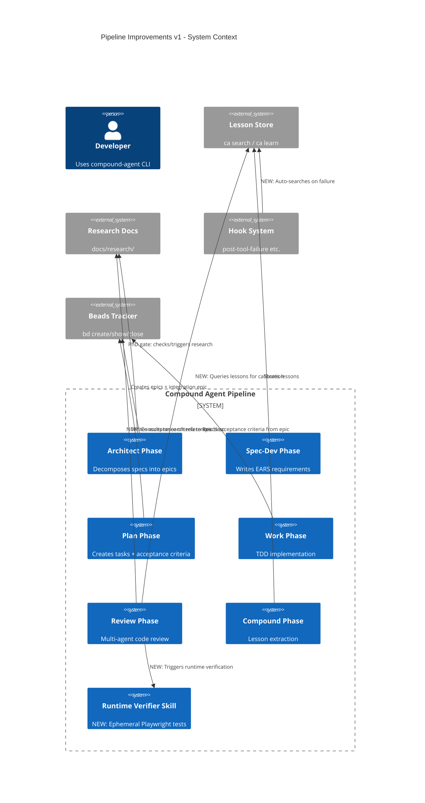
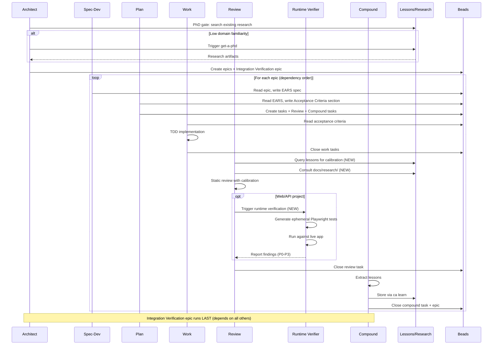

# Pipeline Improvements v1

> **Spec ID**: SPEC-0007
> **Status**: Approved
> **Author**: Architect phase
> **Date**: 2026-03-25
> **Meta-epic**: learning_agent-oj8q
>
> **Epic IDs**:
> - Epic 1 (FE): learning_agent-sr52
> - Epic 2 (PhD+IV): learning_agent-obc5
> - Epic 3 (AC): learning_agent-cxm6
> - Epic 4 (LCR+RV): learning_agent-cqrr
> - Epic 5 (Integration): learning_agent-ji6n
> - Backlog (Context Resets): learning_agent-364m

## 1. Problem Statement

The compound-agent pipeline has strong foundations (lesson system, 24-agent review, infinity loop) but underutilizes its own knowledge during reviews, lacks runtime verification, and has workflow gaps in acceptance criteria, failure escalation, and research triggering. A recent infinity loop audit surfaced: *"14 well-tested components that don't actually talk to each other correctly"* — confirming that integration testing is a structural blind spot.

## 2. System-Level EARS Requirements

### 2.1 Lesson-Calibrated Reviewers (LCR)

| ID | Pattern | Requirement |
|----|---------|-------------|
| LCR-1 | Event | When a review subagent begins its review pass, the system shall instruct the subagent to query `ca search` with the current review context (file paths, change summary, domain keywords) and use matching lessons as calibration context. |
| LCR-2 | Event | When a review subagent begins its review pass, the system shall instruct the subagent to consult relevant files in `docs/research/` for methodology references applicable to its review domain. |
| LCR-3 | Unwanted | If a reviewer produces a finding that contradicts a previously captured lesson (severity >= high), the system shall flag the contradiction for human review. |

### 2.2 Runtime Verification Skill (RV)

| ID | Pattern | Requirement |
|----|---------|-------------|
| RV-1 | Event | When the review phase encounters a project with a web UI or HTTP API, the runtime-verifier skill shall generate ephemeral Playwright/Puppeteer test scripts that exercise the running application. |
| RV-2 | Ubiquitous | The runtime-verifier skill shall ship with research references from `docs/research/q-and-a/runtime-verification.md` and code snippet examples demonstrating common test patterns (API contract, UI smoke, state transition). |
| RV-3 | Event | When ephemeral tests complete, the system shall report results as review findings classified by severity (P0-P3). |
| RV-4 | Unwanted | If the runtime-verifier cannot start the application under test (missing dependencies, build failure), it shall report a P1 finding with diagnostic details rather than silently skipping verification. |
| RV-5 | Event | When the runtime-verifier generates test code, the agent shall use Playwright/Puppeteer library APIs (code generation), not browser MCP tools (direct control). |

### 2.3 Acceptance Criteria Enhancement (AC)

| ID | Pattern | Requirement |
|----|---------|-------------|
| AC-1 | Event | When the plan phase creates tasks from an epic, it shall extract testable acceptance criteria from the EARS requirements in the epic description and write them to an explicit `## Acceptance Criteria` section in the epic description. |
| AC-2 | Ubiquitous | The review phase shall check implementation against the acceptance criteria in the epic description before producing findings. |
| AC-3 | Unwanted | If the review phase cannot find an `## Acceptance Criteria` section in the epic description, the system shall flag this as a P1 process finding. |
| AC-4 | Event | When the work phase begins on a task, the agent shall read the parent epic's acceptance criteria to understand what "done" means for the task. |

### 2.4 Integration Verification Epic (IV)

| ID | Pattern | Requirement |
|----|---------|-------------|
| IV-1 | Event | When the architect materializes epics (Phase 4), it shall create a final "Integration Verification" epic that depends on ALL other materialized epics. |
| IV-2 | State | While composing the integration verification epic, the architect shall scope testing depth proportionally: light smoke tests for ≤3 epics with minimal interfaces, full integration suite for >3 epics or complex cross-boundary contracts. |
| IV-3 | Ubiquitous | The integration verification epic shall go through the full cook-it pipeline (spec-dev → plan → work → review → compound) like any other epic. |
| IV-4 | Event | When the integration verification epic's plan phase runs, it shall produce tasks that test cross-epic interfaces identified in the architect's interface contracts. |
| IV-5 | Unwanted | If an integration test reveals a cross-boundary failure, the system shall create a new bug bead with dependencies pointing to the originating epics. |

### 2.5 Smarter Failure Escalation (FE)

| ID | Pattern | Requirement |
|----|---------|-------------|
| FE-1 | Event | When a tool fails ≥3 times on the same target within a session, the `post-tool-failure` hook shall automatically run `ca search` with the error message and target context. |
| FE-2 | Event | When `ca search` returns matching lessons (similarity > threshold), the hook shall inject the top 3 matching lessons into the hook output for the agent to consume. |
| FE-3 | Unwanted | If `ca search` returns no matches, the hook shall fall back to the existing generic tip behavior (no regression). |

### 2.6 get-a-phd Auto-Trigger (PhD)

| ID | Pattern | Requirement |
|----|---------|-------------|
| PhD-1 | Event | When architect Phase 1 (Socratic) begins, the system shall search `ca search` and `docs/research/` for existing domain knowledge relevant to the current specification. |
| PhD-2 | State | While domain familiarity is assessed as low (< 3 relevant results from combined search), the system shall recommend triggering full get-a-phd research and explain why. |
| PhD-3 | Optional | Where the architect determines sufficient domain knowledge already exists, the system shall proceed with existing research without triggering get-a-phd. |
| PhD-4 | Event | When get-a-phd completes research, the system shall store structured research artifacts in `docs/research/` so they persist across sessions and survive context resets. |

### 2.7 Per-Phase Context Resets (DEFERRED)

> **Status**: Backlog. Not in scope for v1.
> **Concept**: Spawn fresh Claude sessions per cook-it phase within infinity loop, with structured handoff artifacts (beads + diff + review report).
> **Rationale**: Deferred because the workflow implications need more investigation. Will be tracked as a standalone backlog epic.

## 3. Architecture Diagrams

### 3.1 C4 Context: Enhanced Pipeline

### 3.2 Sequence: Enhanced Cook-It Flow

### 3.3 State: Epic Lifecycle with Integration Epic

```mermaid
stateDiagram-v2
    [*] --> Architect: System spec provided

    Architect --> EpicsCreated: Phase 4 Materialize

    state EpicsCreated {
        [*] --> WorkEpics: Domain epics
        [*] --> IntegrationEpic: Always created last
        WorkEpics --> IntegrationEpic: all work epics depend-on
    }

    EpicsCreated --> InfinityLoop: Phase 5 Launch

    state InfinityLoop {
        [*] --> ProcessEpic
        ProcessEpic --> CookIt

        state CookIt {
            [*] --> SpecDev
            SpecDev --> Plan: EARS written
            Plan --> PlanWithAC: Write Acceptance Criteria
            PlanWithAC --> Work: Tasks created
            Work --> ReviewCalibrated: Work complete

            state ReviewCalibrated {
                [*] --> QueryLessons: ca search
                QueryLessons --> ConsultResearch: docs/research/
                ConsultResearch --> StaticReview
                StaticReview --> RuntimeVerify: if web/API
                RuntimeVerify --> ConsolidateFindings
                StaticReview --> ConsolidateFindings: if CLI/lib
            }

            ReviewCalibrated --> Compound: Approved
            Compound --> [*]: Epic closed
        }

        CookIt --> ProcessEpic: Next epic
        CookIt --> IntegrationPhase: All work epics done

        state IntegrationPhase {
            [*] --> IntCookIt: Full cook-it on integration epic
            IntCookIt --> [*]: Integration verified
        }
    }

    InfinityLoop --> [*]: All epics including integration complete
```

## 4. Scenario Table

| ID | Scenario | Type | Source Req |
|----|----------|------|-----------|
| S1 | Reviewer queries ca search, finds 5 matching lessons, uses top 3 as calibration | Happy | LCR-1 |
| S2 | Reviewer queries ca search, finds 0 lessons (fresh repo) | Boundary | LCR-1 |
| S3 | Reviewer finding contradicts a high-severity lesson | Error | LCR-3 |
| S4 | Runtime verifier generates Playwright tests for Express API | Happy | RV-1 |
| S5 | Runtime verifier encounters project with no web UI or API | Boundary | RV-1 |
| S6 | Runtime verifier cannot start app (missing deps) | Error | RV-4 |
| S7 | Plan writes acceptance criteria from 8 EARS requirements | Happy | AC-1 |
| S8 | Review finds no acceptance criteria section in epic | Error | AC-3 |
| S9 | Work reads acceptance criteria, maps to task scope | Happy | AC-4 |
| S10 | Architect creates 5 work epics + 1 integration epic | Happy | IV-1 |
| S11 | Architect creates 2 simple epics, integration epic is light smoke | Boundary | IV-2 |
| S12 | Integration test reveals cross-boundary failure | Error | IV-5 |
| S13 | Tool fails 3 times, ca search finds matching lesson | Happy | FE-1, FE-2 |
| S14 | Tool fails 3 times, ca search finds nothing | Boundary | FE-3 |
| S15 | Architect Phase 1 finds rich existing research | Happy | PhD-1, PhD-3 |
| S16 | Architect Phase 1 finds <3 results, recommends get-a-phd | Happy | PhD-2 |
| S17 | Architect Phase 1: Claude decides domain is well-known, skips PhD | Boundary | PhD-3 |
| S18 | Integration epic catches that module A's output format ≠ module B's expected input | Adversarial | IV-4 |
| S19 | Runtime verifier MCP browser used instead of Playwright code gen | Adversarial | RV-5 |

## 5. Files Modified

| File | Change | Epic |
|------|--------|------|
| `go/internal/setup/templates/skills/review/SKILL.md` | Add lesson + research consultation instructions for subagents | LCR |
| `go/internal/setup/templates/skills/review/references/` | Add calibration guidance reference | LCR |
| NEW: `go/internal/setup/templates/skills/runtime-verifier/SKILL.md` | New skill: ephemeral runtime verification | RV |
| NEW: `go/internal/setup/templates/skills/runtime-verifier/references/` | Playwright patterns, research excerpts | RV |
| `go/internal/setup/templates/skills/plan/SKILL.md` | Add acceptance criteria extraction step | AC |
| `go/internal/setup/templates/skills/review/SKILL.md` | Add acceptance criteria check step | AC |
| `go/internal/setup/templates/skills/work/SKILL.md` | Add acceptance criteria reading step | AC |
| `go/internal/setup/templates/skills/spec-dev/SKILL.md` | Clarify EARS → acceptance criteria flow | AC |
| `go/internal/setup/templates/skills/architect/SKILL.md` | Add integration epic to Phase 4, PhD gate to Phase 1 | IV, PhD |
| `go/internal/hook/post_tool_failure.go` (or equivalent) | Add auto ca search on repeated failures | FE |
| `go/internal/setup/templates/skills/cook-it/SKILL.md` | Update to reference new acceptance criteria flow | AC |

## 6. Non-Goals (v1)

- Per-phase context resets (deferred to backlog epic)
- Simplification audit of reviewer count (Point 3 — skipped per user)
- Committed test files from runtime verifier (ephemeral only in v1)
- Shipping pre-built lesson examples (subagents query dynamically instead)
