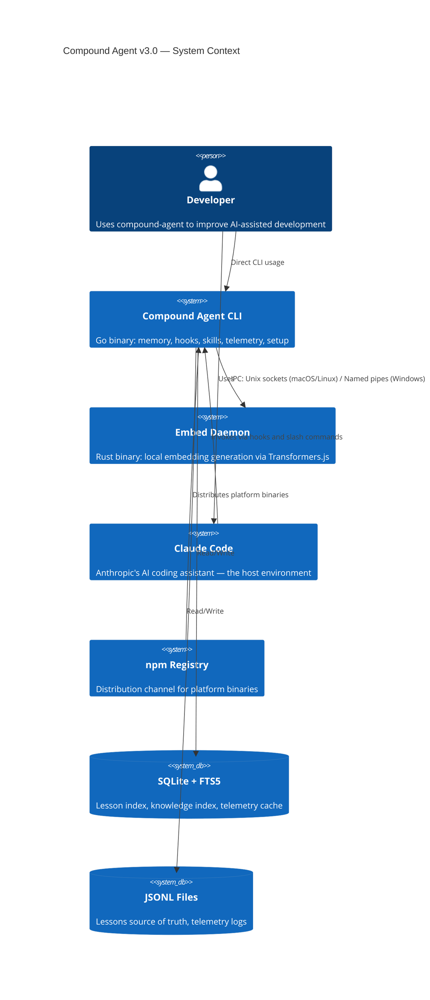
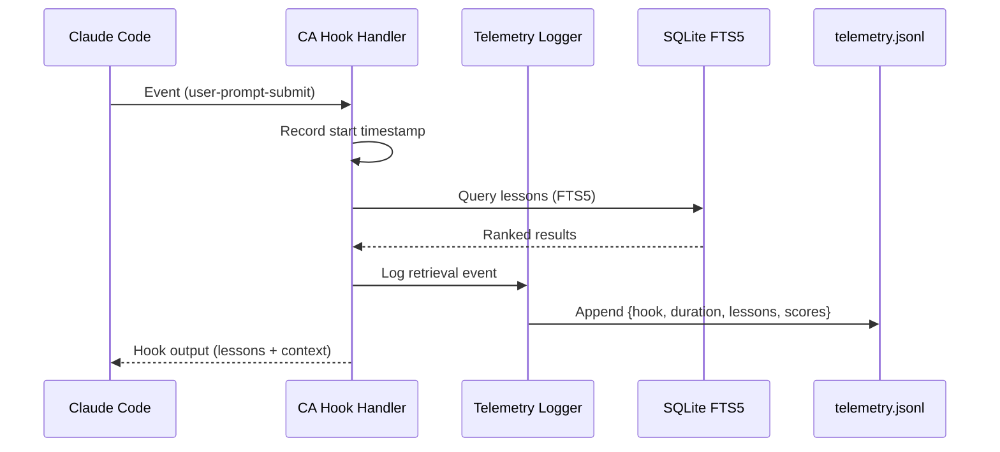
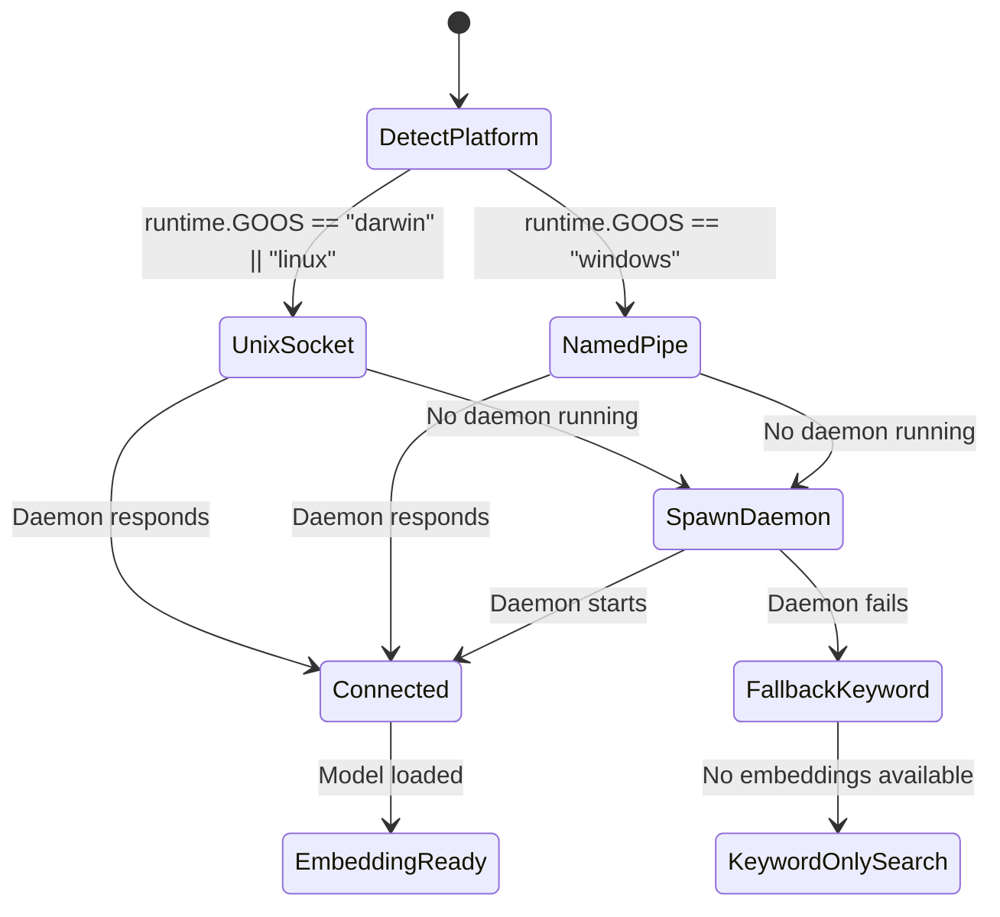

# Compound Agent v3.0 — Harness Overhaul Specification

**Author**: Architect phase, compound-agent
**Date**: 2026-03-31
**Status**: Draft
**Meta-epic**: TBD (created in Phase 4)

## 1. Problem Statement

Compound-agent's memory substrate and phase methodology are strong foundations, but the harness layer — how skills activate, how the system explains itself, how runtime behavior is observed, and which platforms are supported — has not kept pace. Users struggle to understand what the system does and how to use it, Windows users are blocked entirely, skill routing relies on prose instead of metadata, and there is no telemetry to guide tuning decisions. Documentation contains trust-breaking inaccuracies (TypeScript references, wrong hook counts).

## 2. System-Level EARS Requirements

### Ubiquitous Requirements

- **REQ-U1**: The system SHALL support macOS (arm64, x64) and Linux (arm64, x64) natively, with Windows supported via WSL2 documentation.
- **REQ-U2**: All CLI commands SHALL produce consistent behavior across natively supported platforms.
- **REQ-U3**: Every skill template SHALL contain structured frontmatter metadata with at minimum: `name`, `description`, and `phase` fields.
- **REQ-U4**: Documentation SHALL accurately reflect the installed system state (hook count, technology stack, available commands).

### Event-Driven Requirements

- **REQ-E1**: WHEN a hook fires, THEN the system SHALL log a telemetry event containing `{hook_name, timestamp, duration_ms, outcome}` to the telemetry SQLite table.
- **REQ-E2**: WHEN `ca explain` is invoked, THEN the system SHALL output a structured overview of installed hooks, skills, phase workflow, and data flow.
- **REQ-E3**: WHEN `ca doctor` detects a Windows environment without WSL2, THEN the system SHALL recommend WSL2 installation.
- **REQ-E4**: WHEN a lesson is retrieved by a hook, THEN the system SHALL log `{lesson_id, query_hash, score, hook_name}` to the telemetry SQLite table.

### State-Driven Requirements

- **REQ-S1**: WHILE the telemetry table exceeds 100,000 rows, the system SHALL prune oldest entries on next write.
- **REQ-S3**: WHILE no skill frontmatter matches the current context, the system SHALL fall back to loading all skills (backwards-compatible behavior).

### Unwanted Behavior Requirements

- **REQ-W1**: The system SHALL NOT reference TypeScript, npm plugins, or other outdated technology descriptions in any documentation.
- **REQ-W2**: The system SHALL NOT emit telemetry data to any remote service (local-only).
- **REQ-W3**: Telemetry query fields SHALL be truncated or hashed to prevent sensitive data leakage.

### Optional Requirements

- **REQ-O1**: WHERE supported, the system SHOULD provide `ca health` to query telemetry data for hook latency, retrieval rates, and phase transition statistics.
- **REQ-O2**: WHERE the user has configured `"hints": true`, the system SHOULD emit a single workflow-oriented hint on the first session in a new repository.

## 3. Architecture Diagrams

### C4 Context Diagram

### Sequence Diagram — Hook Telemetry Flow

### State Diagram — Platform IPC

## 4. Scenario Table

| ID | Scenario | Trigger | Expected Outcome | EARS Req |
|----|----------|---------|------------------|----------|
| S1 | New user runs `ca setup` on macOS | `ca setup` | Hooks + skills + templates installed, `ca explain` works | REQ-U3, REQ-E2 |
| S2 | New user runs `ca setup` on Windows | `ca setup` on Win | Same as S1 but with Windows paths, named pipe IPC config | REQ-E3, REQ-E4 |
| S3 | Hook fires on prompt submit | Claude Code event | Lesson query + telemetry event logged | REQ-E1, REQ-E5 |
| S4 | User runs `ca explain` | CLI invocation | Structured output: hooks, skills, phases, data flow | REQ-E2 |
| S5 | User runs `ca health` | CLI invocation | Telemetry summary: avg hook latency, retrieval counts | REQ-O1 |
| S6 | Skill metadata matches context | Hook/skill loading | Only matching skills loaded, others deferred | REQ-U3, REQ-S3 |
| S7 | Telemetry log grows large | Log > 10MB | Automatic rotation | REQ-S2 |
| S8 | First session in new repo | Session start hook | Single workflow hint emitted (if hints enabled) | REQ-O2 |
| S9 | Windows user attempts loop | `ca loop` on Win | Clear message: loops not yet supported on Windows | REQ-S1 |
| S10 | Documentation audit | Any doc read | No TypeScript refs, correct hook counts | REQ-W1, REQ-U4 |

## 5. Non-Functional Requirements

- **NFR-1**: Hook execution latency SHALL NOT increase by more than 50ms due to telemetry logging.
- **NFR-2**: `ca setup` SHALL complete in under 5 seconds on a warm filesystem.
- **NFR-3**: Windows support SHALL NOT add more than 2MB to the distributed binary size.
- **NFR-4**: All cross-platform code SHALL use `filepath.Join()` and `os.PathSeparator` instead of hardcoded separators.

## 6. Out of Scope (Deferred to v3.1)

- `ca dream` (memory consolidation) — requires telemetry data foundation
- Contradiction detection — requires telemetry
- Hook output caching — not a felt performance problem
- Pre-tool risk classification — Claude Code handles this natively
- Autonomous loops on Windows — requires alternative to screen sessions
- Dynamic skill loader (runtime install from URL)
- Tiered/minimal installation modes

## 7. Migration Path

- v2.5.x → v3.0: `ca setup` re-run updates hooks, skills, and templates in-place
- Existing lessons are preserved (no schema changes)
- New frontmatter fields are additive (old skills without them fall back to load-all behavior per REQ-S3)
- Windows is a new platform, no migration needed
- Breaking: documentation content changes (not breaking for machines, only for human expectations)
