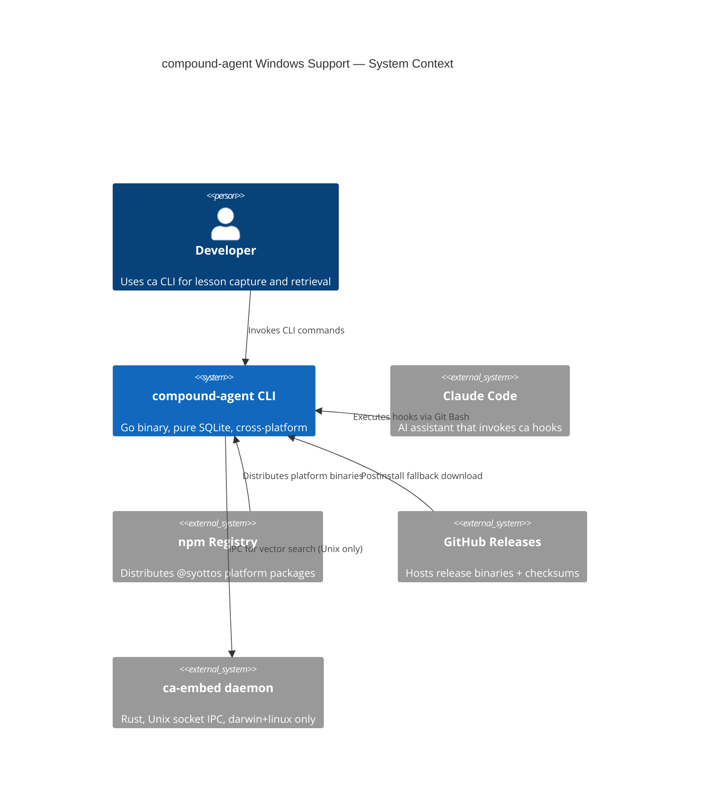
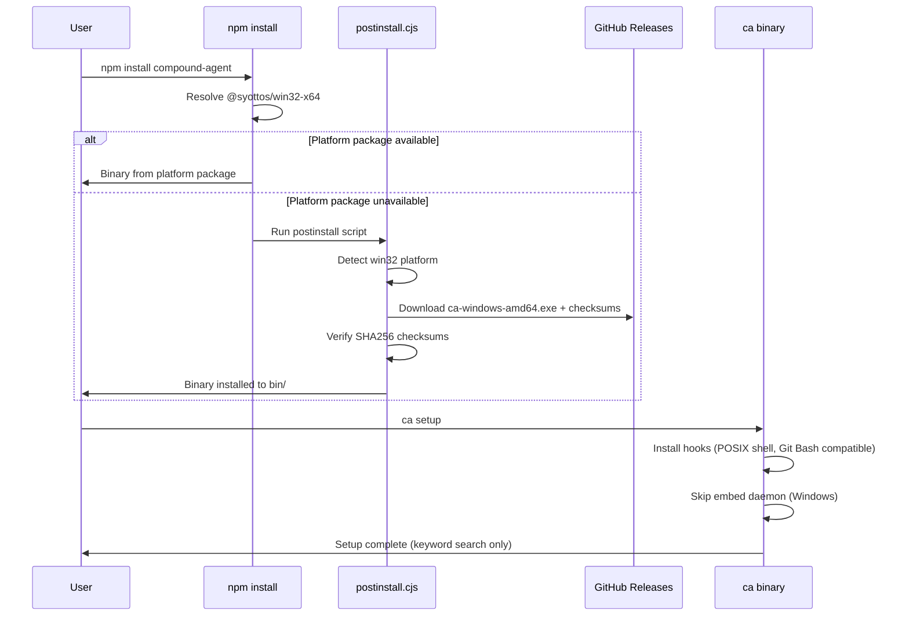
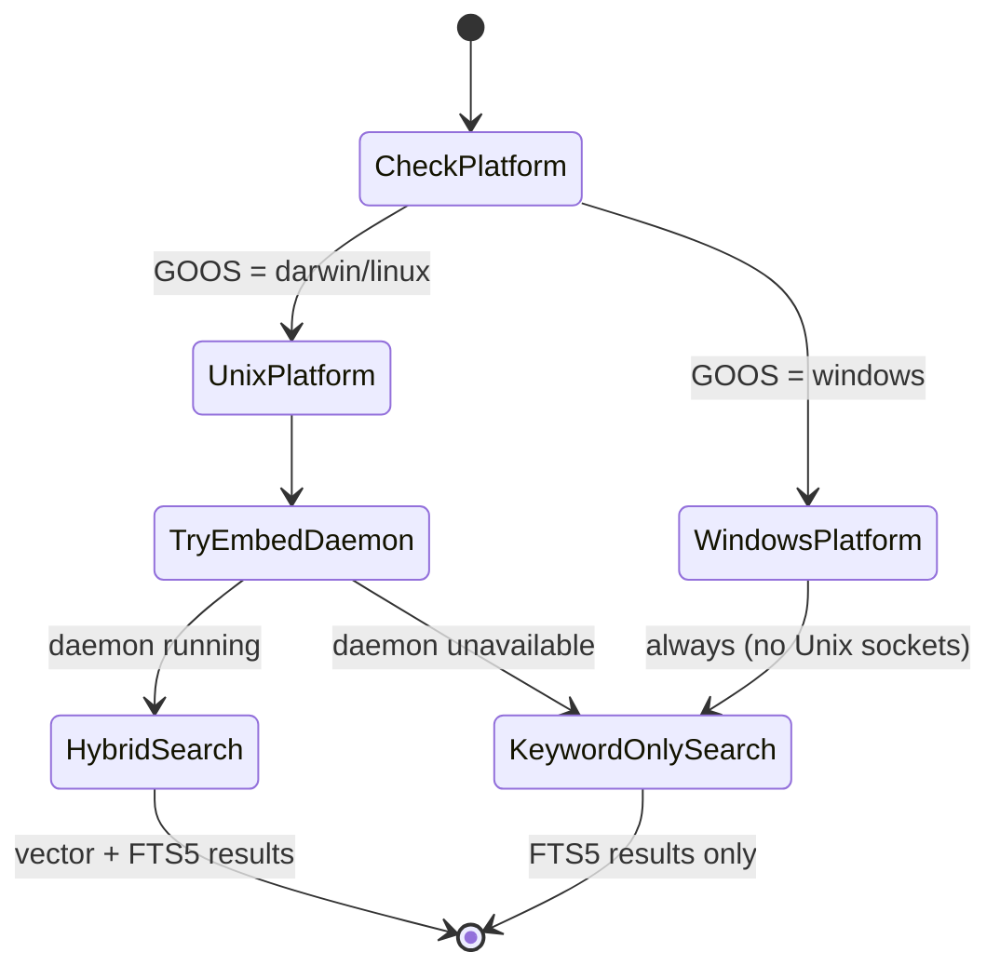

# Windows Native Support — System Specification

**Status**: Draft
**Created**: 2026-04-01
**Delivery profile**: `cli` (advisory — verification contracts are per-epic)

## 1. Problem Statement

compound-agent currently requires CGO (`mattn/go-sqlite3`) and ships binaries only for darwin and linux. Windows users cannot install or run the CLI natively. The Rust embed daemon uses Unix domain sockets, further blocking Windows. This spec defines the migration to pure Go SQLite, platform-correct Windows code, and full build/distribution pipeline support.

## 2. EARS Requirements

### Ubiquitous Requirements (always true)

| ID | Requirement |
|----|-------------|
| U1 | The CLI **shall** produce identical lesson/knowledge query results on Windows, macOS, and Linux given the same database contents. |
| U2 | The CLI **shall** build with `CGO_ENABLED=0` on all platforms. |
| U3 | The SQLite database schema **shall** be binary-compatible across platforms (same `.sqlite` file readable on all three OS). |
| U4 | All existing tests **shall** pass on darwin and linux after the SQLite driver swap. |
| U5 | The `ca` binary **shall** be distributable via npm platform packages (`@syottos/{platform}-{arch}`). |

### Event-Driven Requirements

| ID | Requirement |
|----|-------------|
| E1 | **When** a user runs `ca setup` on Windows, the CLI **shall** install hooks using the same POSIX shell syntax (Claude Code uses Git Bash on Windows). |
| E2 | **When** `ca search` is invoked and the embed daemon is unavailable, the CLI **shall** fall back to keyword-only FTS5 search without error. |
| E3 | **When** a user runs `ca info --open` on Windows, the CLI **shall** open the URL using `cmd /c start "" <url>`. |
| E4 | **When** the postinstall script runs on win32, it **shall** download the correct `ca-windows-{arch}` binary from GitHub Releases. |
| E5 | **When** two processes attempt concurrent schema rebuild on Windows, file locking via `LockFileEx` **shall** prevent corruption. |

### State-Driven Requirements

| ID | Requirement |
|----|-------------|
| S1 | **While** running on Windows, the embed daemon **shall not** be started (Unix sockets unavailable). |
| S2 | **While** `CGO_ENABLED=0`, the build **shall not** require a C compiler on any platform. |
| S3 | **While** the CI matrix includes `windows-latest`, all Go tests **shall** pass or be correctly guarded with `//go:build !windows`. |

### Unwanted Behavior Requirements

| ID | Requirement |
|----|-------------|
| W1 | The CLI **shall** prevent `os.Rename` failures on Windows when the target file is held open by another process, by closing files before rename. |
| W2 | The SQLite driver swap **shall not** change the on-disk schema format or require migration of existing databases. |
| W3 | The CLI **shall not** panic or produce unhandled errors when Unix-only code paths are reached on Windows. |

### Optional Requirements

| ID | Requirement |
|----|-------------|
| O1 | **Where** supported, the Windows binary **may** include PE version metadata (via goversioninfo or equivalent). |
| O2 | **Where** Authenticode signing is available, Windows binaries **may** be signed. |

## 3. Architecture Diagrams

### C4 Context Diagram

### Sequence Diagram — Windows Installation Flow

### State Diagram — Search Fallback

## 4. Scenario Table

| Scenario | EARS Ref | Input | Expected Outcome |
|----------|----------|-------|-----------------|
| Fresh install on Windows via npm | E4, U5 | `npm install compound-agent` on win32-x64 | Platform package resolves, binary works |
| Postinstall fallback on Windows | E4 | Platform pkg unavailable, postinstall runs | Downloads .exe from GitHub, checksums pass |
| Search without embed daemon | E2, S1 | `ca search "query"` on Windows | Returns FTS5 keyword results, no error |
| Concurrent schema rebuild | E5 | Two ca processes start simultaneously | LockFileEx prevents corruption |
| Open URL on Windows | E3 | `ca info --open` | Opens browser via `cmd /c start ""` |
| Hook execution on Windows | E1 | Claude Code invokes `ca hooks run` | Git Bash runs POSIX hook commands |
| Cross-platform build | U2, S2 | `go build` with CGO_ENABLED=0 | Builds without C compiler on all platforms |
| Existing database compatibility | W2, U3 | Open lessons.sqlite from macOS on Windows | Same query results |
| Unix-only test on Windows | S3 | `go test ./...` on windows-latest | Unix socket tests skipped, rest pass |
| os.Rename with open file | W1 | Atomic write during concurrent access | No EPERM/EACCES error |

## 5. Non-Goals (Explicit Exclusions)

- **Rust embed daemon on Windows**: Deferred. Would require TCP socket migration, security analysis (loses Unix socket 0600 permissions). Keyword search provides ~80% of value.
- **PowerShell installer**: Users install via npm. No separate Windows installer needed.
- **WSL2 proxy approach**: Rejected in favor of native Go binary (previous session research).
- **Windows ARM CI**: GitHub Actions doesn't provide `windows-arm64` runners. Build via cross-compilation, test via community.

## 6. Risk Register

| Risk | Likelihood | Impact | Mitigation |
|------|-----------|--------|------------|
| modernc.org/sqlite performance regression | Low | Medium | Benchmark before/after; modernc is widely used (4k+ GitHub stars) |
| modernc DSN format incompatibility | Low | High | Comprehensive DSN test coverage in epic 1 |
| Windows os.Rename EACCES | Medium | Medium | Close files before rename; add retry with backoff |
| npm platform package naming | Low | Low | Follow existing @syottos pattern; test publish in dry-run |
| CI flakiness on windows-latest | Medium | Low | Skip known-flaky tests with clear TODO markers |
